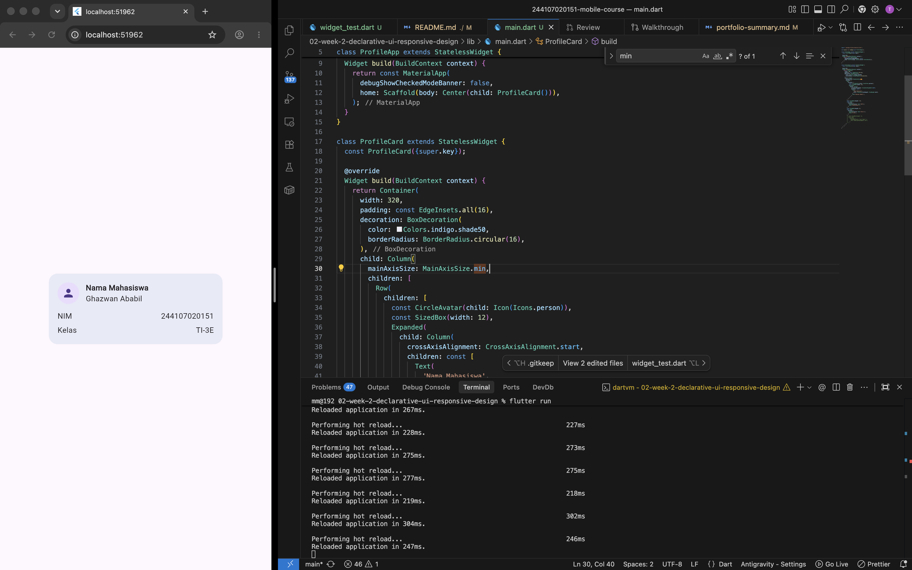
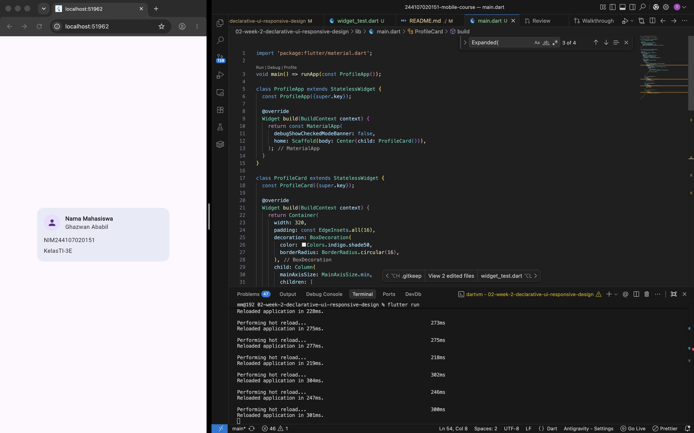
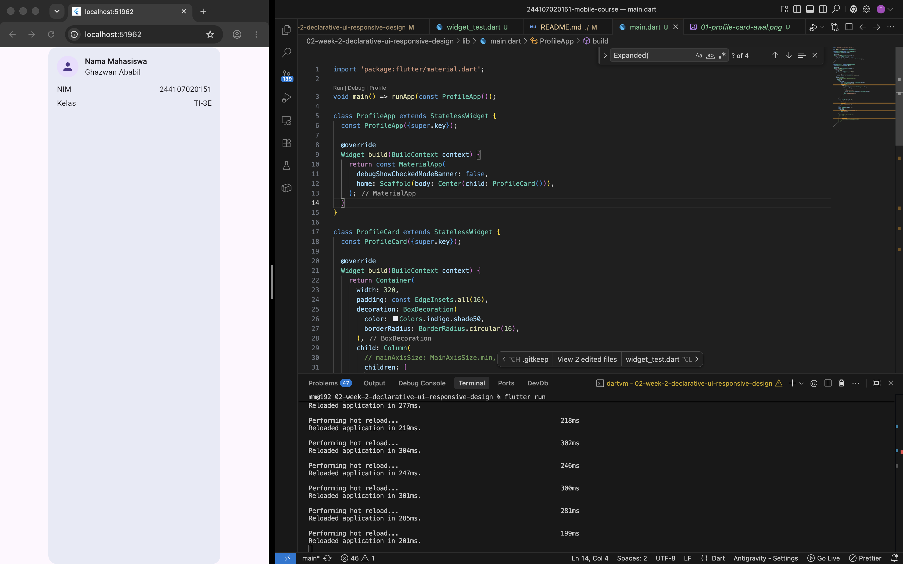
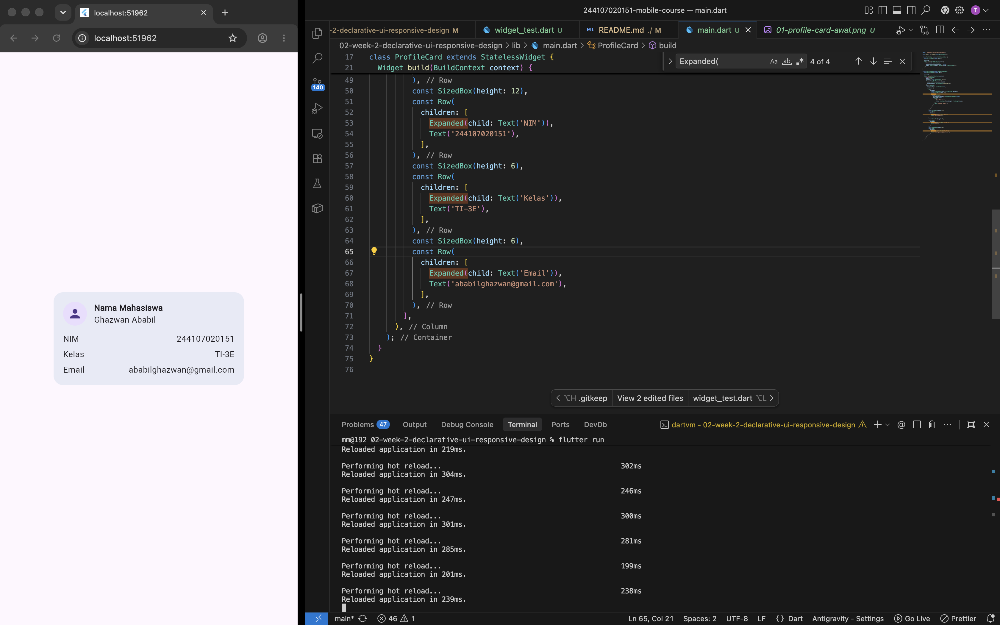
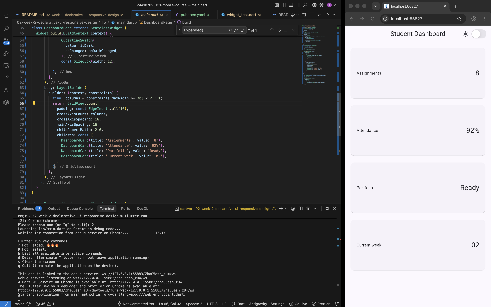
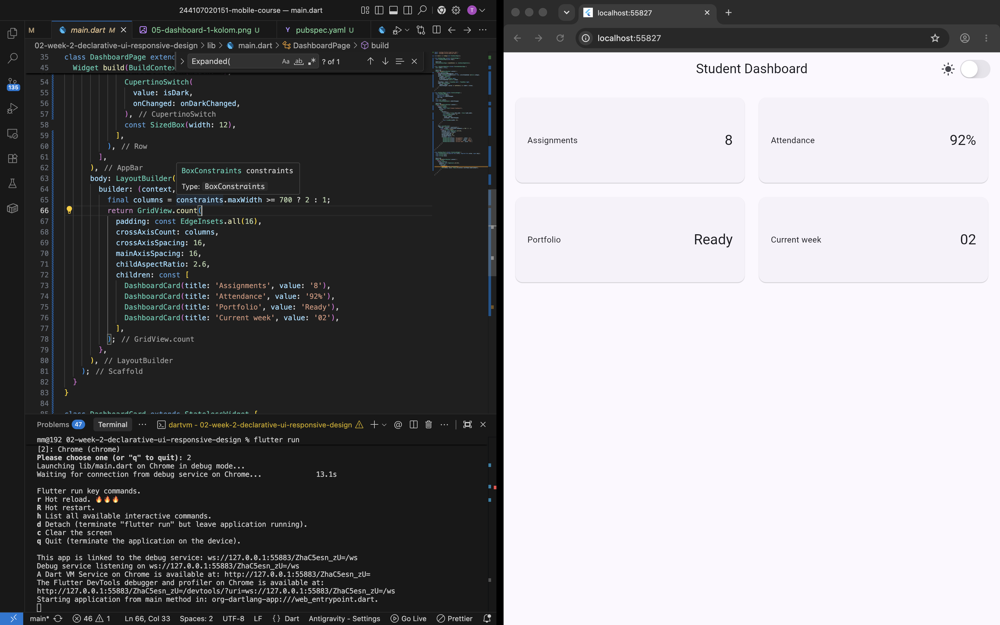
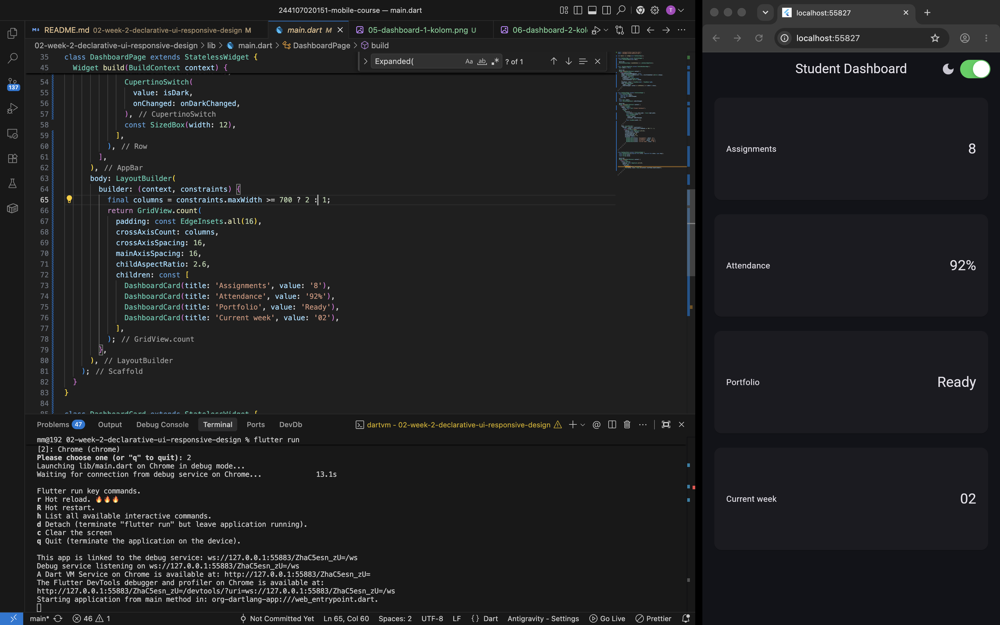

# Laporan Praktikum: Minggu 02 - Declarative UI & Responsive Design

- **Nama Mahasiswa**: Ghazwan Ababil
- **NIM**: 244107020151
- **Repositori**: [244107020151-mobile-course](https://github.com/ghazwanz/244107020151-mobile-course)
- **Status Tugas**: 🔄 _In Progress (Sedang Berjalan)_

---

## 1. Tujuan

Memahami dan melatih penggunaan widget tata letak dasar (`Container`, `Column`, `Row`, `Expanded`, `CircleAvatar`) serta mengamati perilaku ukuran dimensi (_constraints_) dan _overflow_ sebelum membangun dashboard responsif.

---

## 2. Praktikum: Layout Sederhana (Warm-up)

Praktikum ini membuat kartu profil sederhana (_ProfileCard_) pada file `lib/main.dart` menggunakan kombinasi `Container`, `Column`, dan `Row`.

### Kode Implementasi

```dart
import 'package:flutter/material.dart';

void main() => runApp(const ProfileApp());

class ProfileApp extends StatelessWidget {
  const ProfileApp({super.key});

  @override
  Widget build(BuildContext context) {
    return const MaterialApp(
      debugShowCheckedModeBanner: false,
      home: Scaffold(
        body: Center(child: ProfileCard()),
      ),
    );
  }
}

class ProfileCard extends StatelessWidget {
  const ProfileCard({super.key});

  @override
  Widget build(BuildContext context) {
    return Container(
      width: 320,
      padding: const EdgeInsets.all(16),
      decoration: BoxDecoration(
        color: Colors.indigo.shade50,
        borderRadius: BorderRadius.circular(16),
      ),
      child: Column(
        mainAxisSize: MainAxisSize.min,
        children: [
          Row(
            children: [
              const CircleAvatar(child: Icon(Icons.person)),
              const SizedBox(width: 12),
              Expanded(
                child: Column(
                  crossAxisAlignment: CrossAxisAlignment.start,
                  children: const [
                    Text(
                      'Nama Mahasiswa',
                      style: TextStyle(fontWeight: FontWeight.bold),
                    ),
                    Text('Ghazwan Ababil'),
                  ],
                ),
              ),
            ],
          ),
          const SizedBox(height: 12),
          const Row(
            children: [
              Expanded(child: Text('NIM')),
              Text('244107020151'),
            ],
          ),
          const SizedBox(height: 6),
          const Row(
            children: [
              Expanded(child: Text('Kelas')),
              Text('TI-3E'),
            ],
          ),
          const SizedBox(height: 6),
          const Row(
            children: [
              Expanded(child: Text('Email')),
              Flexible(
                child: Text(
                  'ababilghazwan@gmail.com',
                  overflow: TextOverflow.ellipsis,
                ),
              ),
            ],
          ),
        ],
      ),
    );
  }
}
```



---

### Hasil Eksperimen Warm-up

1. **Eksperimen 1: Menghapus `Expanded` pada baris nama**
   - Widget `Expanded` berfungsi untuk mengisi sisa ruang horizontal yang tersedia di dalam `Row`.
   - Ketika `Expanded` dihapus, `Column` teks nama akan mengambil lebar menyesuaikan dengan lebar isi teks (child), sehingga teks nama yang panjang menyebabkan _layout overflow_.

   

2. **Eksperimen 2: Mengganti `mainAxisSize: MainAxisSize.min` ke nilai default (`MainAxisSize.max`)**
   - Secara default, nilai `mainAxisSize` pada `Column` adalah `MainAxisSize.max`.
   - Ketika `mainAxisSize` diubah menjadi `MainAxisSize.max` (atau dihapus), kartu profil akan memanjang vertikal mengambil seluruh ruang tinggi layar yang tersedia. Sebaliknya, `MainAxisSize.min` membuat tinggi kartu menyesuaikan dengan isi konten.

   

3. **Eksperimen 3: Menambahkan satu baris data (Email) dengan pola `Row` + `Expanded`**
   - Menambahkan baris email dengan pola `Row` + `Expanded(child: Text('Email'))` menghasilkan perataan yang konsisten: teks label `'Email'` mengambil ruang fleksibel di sisi kiri, dan nilai email berada di sisi kanan.
   - Selain itu, membungkus nilai email dengan `Flexible` dan `overflow: TextOverflow.ellipsis` mencegah teks panjang meluap (_overflow_) melewati batas lebar kontainer kartu.

   

---

## 3. Praktikum: Dashboard Responsif

Praktikum ini membuat antarmuka dashboard responsif menggunakan widget `LayoutBuilder`, `GridView.count`, dan kartu metrik `DashboardCard`.

### 1. Implementasi Awal: StatelessWidget & LayoutBuilder

Pada tahap awal, `DashboardApp` dibangun sebagai `StatelessWidget`. Widget `LayoutBuilder` digunakan untuk membaca batasan lebar layar (`constraints.maxWidth`). Jika lebar layar mencapai atau melebihi 700 piksel (`maxWidth >= 700`), grid menampilkan 2 kolom; jika kurang dari 700 piksel, grid beralih otomatis menjadi 1 kolom.

```dart
import 'package:flutter/material.dart';

void main() => runApp(const DashboardApp());

class DashboardApp extends StatelessWidget {
  const DashboardApp({super.key});

  @override
  Widget build(BuildContext context) {
    return MaterialApp(
      debugShowCheckedModeBanner: false,
      theme: ThemeData(useMaterial3: true, colorSchemeSeed: Colors.indigo),
      darkTheme: ThemeData(
        useMaterial3: true,
        brightness: Brightness.dark,
        colorSchemeSeed: Colors.indigo,
      ),
      themeMode: ThemeMode.system,
      home: const DashboardPage(),
    );
  }
}

class DashboardPage extends StatelessWidget {
  const DashboardPage({super.key});

  @override
  Widget build(BuildContext context) {
    return Scaffold(
      appBar: AppBar(title: const Text('Student Dashboard')),
      body: LayoutBuilder(
        builder: (context, constraints) {
          final columns = constraints.maxWidth >= 700 ? 2 : 1;
          return GridView.count(
            padding: const EdgeInsets.all(16),
            crossAxisCount: columns,
            crossAxisSpacing: 16,
            mainAxisSpacing: 16,
            childAspectRatio: 2.6,
            children: const [
              DashboardCard(title: 'Assignments', value: '8'),
              DashboardCard(title: 'Attendance', value: '92%'),
              DashboardCard(title: 'Portfolio', value: 'Ready'),
              DashboardCard(title: 'Current week', value: '02'),
            ],
          );
        },
      ),
    );
  }
}

class DashboardCard extends StatelessWidget {
  const DashboardCard({required this.title, required this.value, super.key});
  final String title;
  final String value;

  @override
  Widget build(BuildContext context) {
    return Card(
      child: Padding(
        padding: const EdgeInsets.all(20),
        child: Row(
          children: [
            Expanded(child: Text(title)),
            Text(value, style: Theme.of(context).textTheme.headlineSmall),
          ],
        ),
      ),
    );
  }
}
```

---

### 2. Menambahkan Interaksi: StatefulWidget dan Cupertino

Aplikasi ditingkatkan menjadi `StatefulWidget` untuk menambahkan fitur interaktif pergantian tema terang dan gelap secara manual melalui komponen `CupertinoSwitch` pada `AppBar`.

```dart
import 'package:flutter/cupertino.dart';
import 'package:flutter/material.dart';

void main() => runApp(const DashboardApp());

class DashboardApp extends StatefulWidget {
  const DashboardApp({super.key});

  @override
  State<DashboardApp> createState() => _DashboardAppState();
}

class _DashboardAppState extends State<DashboardApp> {
  bool isDark = false;

  @override
  Widget build(BuildContext context) {
    return MaterialApp(
      debugShowCheckedModeBanner: false,
      theme: ThemeData(useMaterial3: true, colorSchemeSeed: Colors.indigo),
      darkTheme: ThemeData(
        useMaterial3: true,
        brightness: Brightness.dark,
        colorSchemeSeed: Colors.indigo,
      ),
      themeMode: isDark ? ThemeMode.dark : ThemeMode.light,
      home: DashboardPage(
        isDark: isDark,
        onDarkChanged: (value) => setState(() => isDark = value),
      ),
    );
  }
}

class DashboardPage extends StatelessWidget {
  const DashboardPage({
    required this.isDark,
    required this.onDarkChanged,
    super.key,
  });
  final bool isDark;
  final ValueChanged<bool> onDarkChanged;

  @override
  Widget build(BuildContext context) {
    return Scaffold(
      appBar: AppBar(
        title: const Text('Student Dashboard'),
        actions: [
          Row(
            children: [
              Icon(isDark ? Icons.dark_mode : Icons.light_mode),
              const SizedBox(width: 4),
              CupertinoSwitch(
                value: isDark,
                onChanged: onDarkChanged,
              ),
              const SizedBox(width: 12),
            ],
          ),
        ],
      ),
      body: LayoutBuilder(
        builder: (context, constraints) {
          final columns = constraints.maxWidth >= 700 ? 2 : 1;
          return GridView.count(
            padding: const EdgeInsets.all(16),
            crossAxisCount: columns,
            crossAxisSpacing: 16,
            mainAxisSpacing: 16,
            childAspectRatio: 2.6,
            children: const [
              DashboardCard(title: 'Assignments', value: '8'),
              DashboardCard(title: 'Attendance', value: '92%'),
              DashboardCard(title: 'Portfolio', value: 'Ready'),
              DashboardCard(title: 'Current week', value: '02'),
            ],
          );
        },
      ),
    );
  }
}

class DashboardCard extends StatelessWidget {
  const DashboardCard({required this.title, required this.value, super.key});
  final String title;
  final String value;

  @override
  Widget build(BuildContext context) {
    return Card(
      child: Padding(
        padding: const EdgeInsets.all(20),
        child: Row(
          children: [
            Expanded(child: Text(title)),
            Text(value, style: Theme.of(context).textTheme.headlineSmall),
          ],
        ),
      ),
    );
  }
}
```

---

### Hasil Eksperimen Layout & Interaksi

1. **Eksperimen 1: Perubahan Breakpoint Layar**
   - Nilai breakpoint `constraints.maxWidth >= 700` menentukan responsivitas tampilan: layar sempit (kurang dari 700) akan menampilkan 1 kolom, sedangkan layar lebar (lebih dari 700) akan menampilkan 2 kolom.
   - Mengubah nilai breakpoint ini menggeser batas kapan layout grid bertransisi secara dinamis.

   
   

2. **Eksperimen 2: Perubahan ThemeMode & Penggunaan CupertinoSwitch**
   - Komponen `CupertinoSwitch` dari package Cupertino terdapat toggle dengan style iOS.
   - Perubahan state `isDark` mengubah properti `themeMode` secara state antara `ThemeMode.dark` dan `ThemeMode.light`.

   
   

3. **Eksperimen 3: Pengujian Ukuran Layar Berbeda**
   - Saat dijalankan pada emulator dengan orientasi atau resolusi yang berbeda, `LayoutBuilder` membaca batasan ruang secara langsung dan menyesuaikan layout kartu dashboard berdasarkan screen.

4. **Eksperimen 4: Aksesibilitas Elemen UI**
   - Elemen interaktif seperti toggle dark & light mode pada dashboard dapat dilengkapi label agar mudah dikenali oleh fitur aksesibilitas.
