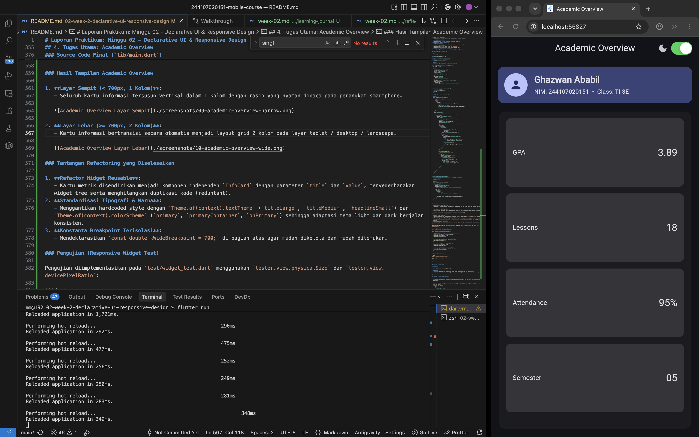
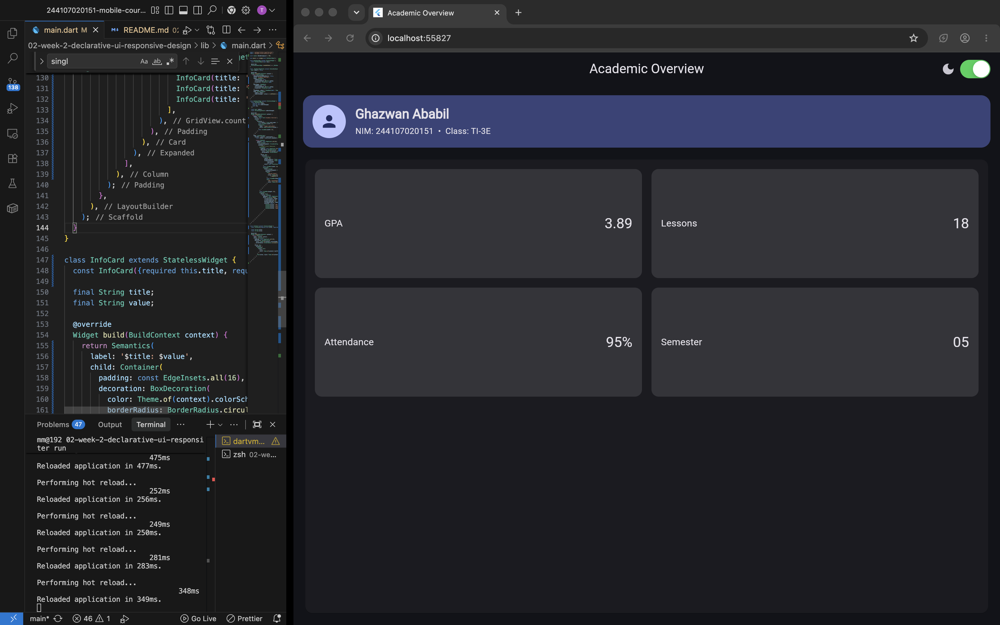

# Laporan Praktikum: Minggu 02 - Declarative UI & Responsive Design

- **Nama Mahasiswa**: Ghazwan Ababil
- **NIM**: 244107020151
- **Repositori**: [244107020151-mobile-course](https://github.com/ghazwanz/244107020151-mobile-course)
- **Status Tugas**: 🔄 _In Progress (Sedang Berjalan)_

---

## 1. Tujuan

Memahami dan melatih penggunaan widget tata letak dasar (`Container`, `Column`, `Row`, `Expanded`, `CircleAvatar`) serta mengamati perilaku ukuran dimensi (_constraints_) dan _overflow_ sebelum membangun dashboard responsif.

---

## 2. Praktikum: Layout Sederhana (Warm-up)

Praktikum ini membuat kartu profil sederhana (_ProfileCard_) pada file `lib/main.dart` menggunakan kombinasi `Container`, `Column`, dan `Row`.

### Kode Implementasi

```dart
import 'package:flutter/material.dart';

void main() => runApp(const ProfileApp());

class ProfileApp extends StatelessWidget {
  const ProfileApp({super.key});

  @override
  Widget build(BuildContext context) {
    return const MaterialApp(
      debugShowCheckedModeBanner: false,
      home: Scaffold(
        body: Center(child: ProfileCard()),
      ),
    );
  }
}

class ProfileCard extends StatelessWidget {
  const ProfileCard({super.key});

  @override
  Widget build(BuildContext context) {
    return Container(
      width: 320,
      padding: const EdgeInsets.all(16),
      decoration: BoxDecoration(
        color: Colors.indigo.shade50,
        borderRadius: BorderRadius.circular(16),
      ),
      child: Column(
        mainAxisSize: MainAxisSize.min,
        children: [
          Row(
            children: [
              const CircleAvatar(child: Icon(Icons.person)),
              const SizedBox(width: 12),
              Expanded(
                child: Column(
                  crossAxisAlignment: CrossAxisAlignment.start,
                  children: const [
                    Text(
                      'Nama Mahasiswa',
                      style: TextStyle(fontWeight: FontWeight.bold),
                    ),
                    Text('Ghazwan Ababil'),
                  ],
                ),
              ),
            ],
          ),
          const SizedBox(height: 12),
          const Row(
            children: [
              Expanded(child: Text('NIM')),
              Text('244107020151'),
            ],
          ),
          const SizedBox(height: 6),
          const Row(
            children: [
              Expanded(child: Text('Kelas')),
              Text('TI-3E'),
            ],
          ),
          const SizedBox(height: 6),
          const Row(
            children: [
              Expanded(child: Text('Email')),
              Flexible(
                child: Text(
                  'ababilghazwan@gmail.com',
                  overflow: TextOverflow.ellipsis,
                ),
              ),
            ],
          ),
        ],
      ),
    );
  }
}
```


---

### Hasil Eksperimen Warm-up

1. **Eksperimen 1: Menghapus `Expanded` pada baris nama**
   - Widget `Expanded` berfungsi untuk mengisi sisa ruang horizontal yang tersedia di dalam `Row`.
   - Ketika `Expanded` dihapus, `Column` teks nama akan mengambil lebar menyesuaikan dengan lebar isi teks (child), sehingga teks nama yang panjang menyebabkan _layout overflow_.

   

2. **Eksperimen 2: Mengganti `mainAxisSize: MainAxisSize.min` ke nilai default (`MainAxisSize.max`)**
   - Secara default, nilai `mainAxisSize` pada `Column` adalah `MainAxisSize.max`.
   - Ketika `mainAxisSize` diubah menjadi `MainAxisSize.max` (atau dihapus), kartu profil akan memanjang vertikal mengambil seluruh ruang tinggi layar yang tersedia. Sebaliknya, `MainAxisSize.min` membuat tinggi kartu menyesuaikan dengan isi konten.

   

3. **Eksperimen 3: Menambahkan satu baris data (Email) dengan pola `Row` + `Expanded`**
   - Menambahkan baris email dengan pola `Row` + `Expanded(child: Text('Email'))` menghasilkan perataan yang konsisten: teks label `'Email'` mengambil ruang fleksibel di sisi kiri, dan nilai email berada di sisi kanan.
   - Selain itu, membungkus nilai email dengan `Flexible` dan `overflow: TextOverflow.ellipsis` mencegah teks panjang meluap (_overflow_) melewati batas lebar kontainer kartu.

   

---

## 3. Praktikum: Dashboard Responsif

Praktikum ini membuat antarmuka dashboard responsif menggunakan widget `LayoutBuilder`, `GridView.count`, dan kartu metrik `DashboardCard`.

### 1. Implementasi Awal: StatelessWidget & LayoutBuilder

Pada tahap awal, `DashboardApp` dibangun sebagai `StatelessWidget`. Widget `LayoutBuilder` digunakan untuk membaca batasan lebar layar (`constraints.maxWidth`). Jika lebar layar mencapai atau melebihi 700 piksel (`maxWidth >= 700`), grid menampilkan 2 kolom; jika kurang dari 700 piksel, grid beralih otomatis menjadi 1 kolom.

```dart
import 'package:flutter/material.dart';

void main() => runApp(const DashboardApp());

class DashboardApp extends StatelessWidget {
  const DashboardApp({super.key});

  @override
  Widget build(BuildContext context) {
    return MaterialApp(
      debugShowCheckedModeBanner: false,
      theme: ThemeData(useMaterial3: true, colorSchemeSeed: Colors.indigo),
      darkTheme: ThemeData(
        useMaterial3: true,
        brightness: Brightness.dark,
        colorSchemeSeed: Colors.indigo,
      ),
      themeMode: ThemeMode.system,
      home: const DashboardPage(),
    );
  }
}

class DashboardPage extends StatelessWidget {
  const DashboardPage({super.key});

  @override
  Widget build(BuildContext context) {
    return Scaffold(
      appBar: AppBar(title: const Text('Student Dashboard')),
      body: LayoutBuilder(
        builder: (context, constraints) {
          final columns = constraints.maxWidth >= 700 ? 2 : 1;
          return GridView.count(
            padding: const EdgeInsets.all(16),
            crossAxisCount: columns,
            crossAxisSpacing: 16,
            mainAxisSpacing: 16,
            childAspectRatio: 2.6,
            children: const [
              DashboardCard(title: 'Assignments', value: '8'),
              DashboardCard(title: 'Attendance', value: '92%'),
              DashboardCard(title: 'Portfolio', value: 'Ready'),
              DashboardCard(title: 'Current week', value: '02'),
            ],
          );
        },
      ),
    );
  }
}

class DashboardCard extends StatelessWidget {
  const DashboardCard({required this.title, required this.value, super.key});
  final String title;
  final String value;

  @override
  Widget build(BuildContext context) {
    return Card(
      child: Padding(
        padding: const EdgeInsets.all(20),
        child: Row(
          children: [
            Expanded(child: Text(title)),
            Text(value, style: Theme.of(context).textTheme.headlineSmall),
          ],
        ),
      ),
    );
  }
}
```

---

### 2. Menambahkan Interaksi: StatefulWidget dan Cupertino

Aplikasi ditingkatkan menjadi `StatefulWidget` untuk menambahkan fitur interaktif pergantian tema terang dan gelap secara manual melalui komponen `CupertinoSwitch` pada `AppBar`.

```dart
import 'package:flutter/cupertino.dart';
import 'package:flutter/material.dart';

void main() => runApp(const DashboardApp());

class DashboardApp extends StatefulWidget {
  const DashboardApp({super.key});

  @override
  State<DashboardApp> createState() => _DashboardAppState();
}

class _DashboardAppState extends State<DashboardApp> {
  bool isDark = false;

  @override
  Widget build(BuildContext context) {
    return MaterialApp(
      debugShowCheckedModeBanner: false,
      theme: ThemeData(useMaterial3: true, colorSchemeSeed: Colors.indigo),
      darkTheme: ThemeData(
        useMaterial3: true,
        brightness: Brightness.dark,
        colorSchemeSeed: Colors.indigo,
      ),
      themeMode: isDark ? ThemeMode.dark : ThemeMode.light,
      home: DashboardPage(
        isDark: isDark,
        onDarkChanged: (value) => setState(() => isDark = value),
      ),
    );
  }
}

class DashboardPage extends StatelessWidget {
  const DashboardPage({
    required this.isDark,
    required this.onDarkChanged,
    super.key,
  });
  final bool isDark;
  final ValueChanged<bool> onDarkChanged;

  @override
  Widget build(BuildContext context) {
    return Scaffold(
      appBar: AppBar(
        title: const Text('Student Dashboard'),
        actions: [
          Row(
            children: [
              Icon(isDark ? Icons.dark_mode : Icons.light_mode),
              const SizedBox(width: 4),
              CupertinoSwitch(
                value: isDark,
                onChanged: onDarkChanged,
              ),
              const SizedBox(width: 12),
            ],
          ),
        ],
      ),
      body: LayoutBuilder(
        builder: (context, constraints) {
          final columns = constraints.maxWidth >= 700 ? 2 : 1;
          return GridView.count(
            padding: const EdgeInsets.all(16),
            crossAxisCount: columns,
            crossAxisSpacing: 16,
            mainAxisSpacing: 16,
            childAspectRatio: 2.6,
            children: const [
              DashboardCard(title: 'Assignments', value: '8'),
              DashboardCard(title: 'Attendance', value: '92%'),
              DashboardCard(title: 'Portfolio', value: 'Ready'),
              DashboardCard(title: 'Current week', value: '02'),
            ],
          );
        },
      ),
    );
  }
}

class DashboardCard extends StatelessWidget {
  const DashboardCard({required this.title, required this.value, super.key});
  final String title;
  final String value;

  @override
  Widget build(BuildContext context) {
    return Card(
      child: Padding(
        padding: const EdgeInsets.all(20),
        child: Row(
          children: [
            Expanded(child: Text(title)),
            Text(value, style: Theme.of(context).textTheme.headlineSmall),
          ],
        ),
      ),
    );
  }
}
```

---

### Hasil Eksperimen Layout & Interaksi

1. **Eksperimen 1: Perubahan Breakpoint Layar**
   - Nilai breakpoint `constraints.maxWidth >= 700` menentukan responsivitas tampilan: layar sempit (kurang dari 700) akan menampilkan 1 kolom, sedangkan layar lebar (lebih dari 700) akan menampilkan 2 kolom.
   - Mengubah nilai breakpoint ini menggeser batas kapan layout grid bertransisi secara dinamis.

   
   

2. **Eksperimen 2: Perubahan ThemeMode & Penggunaan CupertinoSwitch**
   - Komponen `CupertinoSwitch` dari package Cupertino terdapat toggle dengan style iOS.
   - Perubahan state `isDark` mengubah properti `themeMode` secara state antara `ThemeMode.dark` dan `ThemeMode.light`.

   
   

3. **Eksperimen 3: Pengujian Ukuran Layar Berbeda**
   - Saat dijalankan pada emulator dengan orientasi atau resolusi yang berbeda, `LayoutBuilder` membaca batasan ruang secara langsung dan menyesuaikan layout kartu dashboard berdasarkan screen.

4. **Eksperimen 4: Aksesibilitas Elemen UI**
   - Elemen interaktif seperti toggle dark & light mode pada dashboard dapat dilengkapi label agar mudah dikenali oleh fitur aksesibilitas.

---

## 4. Tugas Utama: Academic Overview

Pada tugas utama ini, dashboard dikembangkan menjadi halaman **Academic Overview** lengkap yang memenuhi semua kriteria:

1. **Header Profil Mahasiswa**:
   - Menampilkan `CircleAvatar` profil, nama mahasiswa, serta informasi akademik.
2. **Empat Kartu Informasi Akademik**:
   - Menampilkan metrik akademik
3. **Pemanfaatan Widget Inti**:
   - Menggunakan `Row`, `Column`, `Expanded`, `Container`, dan `Card`.
4. **Responsivitas Layar (Breakpoints)**:
   - Menggunakan konstanta.
   - Menampilkan **1 kolom** pada layar sempit (`constraints.maxWidth < 700`).
   - Menampilkan **2 kolom** pada layar lebar (`constraints.maxWidth >= 700`).
5. **Dukungan Light & Dark Theme**:
   - Menggunakan `MaterialApp` dengan `theme` dan `darkTheme`.
   - Menggunakan `CupertinoSwitch` di `AppBar` untuk mengubah tema.
6. **Aksesibilitas (Accessibility / Semantics)**:
   - Membungkus toggle tema dengan `Semantics(label: 'Toggle mode gelap')`.
   - Membungkus setiap kartu metrik dengan `Semantics(label: '$title: $value')`.

### Source Code Final (`lib/main.dart`)

```dart
import 'package:flutter/cupertino.dart';
import 'package:flutter/material.dart';

const double kWideBreakpoint = 700;

void main() => runApp(const DashboardApp());

class DashboardApp extends StatefulWidget {
  const DashboardApp({super.key});

  @override
  State<DashboardApp> createState() => _DashboardAppState();
}

class _DashboardAppState extends State<DashboardApp> {
  bool isDark = false;

  @override
  Widget build(BuildContext context) {
    return MaterialApp(
      debugShowCheckedModeBanner: false,
      title: 'Academic Overview',
      theme: ThemeData(
        useMaterial3: true,
        colorSchemeSeed: Colors.indigo,
        brightness: Brightness.light,
      ),
      darkTheme: ThemeData(
        useMaterial3: true,
        colorSchemeSeed: Colors.indigo,
        brightness: Brightness.dark,
      ),
      themeMode: isDark ? ThemeMode.dark : ThemeMode.light,
      home: DashboardPage(
        isDark: isDark,
        onDarkChanged: (value) => setState(() => isDark = value),
      ),
    );
  }
}

class DashboardPage extends StatelessWidget {
  const DashboardPage({
    required this.isDark,
    required this.onDarkChanged,
    super.key,
  });

  final bool isDark;
  final ValueChanged<bool> onDarkChanged;

  @override
  Widget build(BuildContext context) {
    return Scaffold(
      appBar: AppBar(
        title: const Text('Academic Overview'),
        actions: [
          Row(
            children: [
              Icon(isDark ? Icons.dark_mode : Icons.light_mode),
              const SizedBox(width: 4),
              Semantics(
                label: 'Toggle mode gelap',
                child: CupertinoSwitch(value: isDark, onChanged: onDarkChanged),
              ),
              const SizedBox(width: 12),
            ],
          ),
        ],
      ),
      body: LayoutBuilder(
        builder: (context, constraints) {
          final isWide = constraints.maxWidth >= kWideBreakpoint;

          return Padding(
            padding: const EdgeInsets.all(16),
            child: Column(
              crossAxisAlignment: CrossAxisAlignment.stretch,
              children: [
                // Header Profil Mahasiswa
                Container(
                  padding: const EdgeInsets.all(16),
                  decoration: BoxDecoration(
                    color: Theme.of(context).colorScheme.primaryContainer,
                    borderRadius: BorderRadius.circular(16),
                  ),
                  child: Row(
                    children: [
                      CircleAvatar(
                        radius: 28,
                        backgroundColor: Theme.of(context).colorScheme.primary,
                        foregroundColor: Theme.of(context)
                            .colorScheme
                            .onPrimary,
                        child: const Icon(Icons.person, size: 32),
                      ),
                      const SizedBox(width: 16),
                      Expanded(
                        child: Column(
                          crossAxisAlignment: CrossAxisAlignment.start,
                          children: [
                            Text(
                              'Ghazwan Ababil',
                              style: Theme.of(context).textTheme.titleLarge
                                  ?.copyWith(fontWeight: FontWeight.bold),
                            ),
                            const SizedBox(height: 4),
                            Text(
                              'NIM: 244107020151  •  Class: TI-3E',
                              style: Theme.of(context).textTheme.bodyMedium,
                            ),
                          ],
                        ),
                      ),
                    ],
                  ),
                ),
                const SizedBox(height: 16),
                // Kartu Informasi Responsif (Grid)
                Expanded(
                  child: Card(
                    child: Padding(
                      padding: const EdgeInsets.all(16),
                      child: GridView.count(
                        crossAxisCount: isWide ? 2 : 1,
                        crossAxisSpacing: 16,
                        mainAxisSpacing: 16,
                        childAspectRatio: isWide ? 3.0 : 2.6,
                        children: const [
                          InfoCard(title: 'GPA', value: '3.89'),
                          InfoCard(title: 'Lessons', value: '18'),
                          InfoCard(title: 'Attendance', value: '95%'),
                          InfoCard(title: 'Semester', value: '05'),
                        ],
                      ),
                    ),
                  ),
                ),
              ],
            ),
          );
        },
      ),
    );
  }
}

class InfoCard extends StatelessWidget {
  const InfoCard({required this.title, required this.value, super.key});

  final String title;
  final String value;

  @override
  Widget build(BuildContext context) {
    return Semantics(
      label: '$title: $value',
      child: Container(
        padding: const EdgeInsets.all(16),
        decoration: BoxDecoration(
          color: Theme.of(context).colorScheme.surfaceContainerHighest,
          borderRadius: BorderRadius.circular(12),
        ),
        child: Row(
          children: [
            Expanded(
              child: Text(
                title,
                style: Theme.of(context).textTheme.titleMedium,
              ),
            ),
            Text(value, style: Theme.of(context).textTheme.headlineSmall),
          ],
        ),
      ),
    );
  }
}
```

### Hasil Tampilan Academic Overview

1. **Layar Sempit (< 700px, 1 Kolom)**:
   - Seluruh kartu informasi tersusun vertikal dalam 1 kolom dengan rasio yang nyaman dibaca pada perangkat smartphone.

   

2. **Layar Lebar (>= 700px, 2 Kolom)**:
   - Kartu informasi bertransisi secara otomatis menjadi layout grid 2 kolom pada layar tablet / desktop / landscape.

   

### Tantangan Refactoring yang Diselesaikan

1. **Refactor Widget Reusable**:
   - Kartu metrik disendirikan menjadi komponen independen `InfoCard` dengan parameter `title` dan `value`, menyederhanakan widget tree serta menghilangkan duplikasi kode (reduntant).
2. **Standardisasi Tipografi & Warna**:
   - Menggantikan hardcoded style dengan `Theme.of(context).textTheme` (`titleLarge`, `titleMedium`, `headlineSmall`) dan `Theme.of(context).colorScheme` (`primary`, `primaryContainer`, `onPrimary`) sehingga adaptasi tema light dan dark berjalan konsisten.
3. **Konstanta Breakpoint Terisolasi**:
   - Mendeklarasikan `const double kWideBreakpoint = 700;` di bagian atas agar mudah dikelola dan mudah ditemukan.

### Pengujian (Responsive Widget Test)

Pengujian diimplementasikan pada `test/widget_test.dart` menggunakan `tester.view.physicalSize` dan `tester.view.devicePixelRatio`:

Hasil eksekusi `flutter test`:

- Hasil Test: [11-test-results.png](./screenshots/11-test-results.png)

---

## 5. AI Prompt Challenge & Design Exploration

### Challenge 1: Prompt Desain

1. **Prompt**:

   > _"Bandingkan dua tata letak dashboard akademik untuk Flutter: versi GridView dan versi LayoutBuilder + Column. Jelaskan trade-off responsif dan aksesibilitasnya."_

2. **Respons**:
   - `GridView`: Tata letak grid otomatis rapi, tetapi tinggi kartu kaku karena rasio aspek terkunci.
   - `LayoutBuilder + Column`: Fleksibel mengatur jumlah kolom dan tinggi kartu bebas mengikuti isi konten, dengan urutan baca pembaca layar lebih alami.

---

### Challenge 2: Prompt Penguatan Konsep

1. **Prompt**:

   > _"Jelaskan kapan penggunaan Expanded justru menyebabkan overflow di dalam Row, beri contoh kode yang gagal dan perbaikannya."_

2. **Respons**:
   - `Expanded` di dalam `Row` membagi sisa ruang secara proporsional. Overflow terjadi jika teks panjang tidak dibungkus `Expanded` (menabrak batas kanan layar) atau jika anak di dalam `Expanded` dipaksa memiliki ukuran tetap yang melebihi ruang yang tersedia.
   - **Contoh Kode Gagal**:
     ```dart
     Row(
       children: [
         const Icon(Icons.info),
         Text('Informasi Akademik Mahasiswa Politeknik Negeri Malang'), // Error: Overflow melebihi lebar layar!
       ],
     )
     ```
   - **Contoh Kode Perbaikan**:
     ```dart
     Row(
       children: [
         const Icon(Icons.info),
         Expanded(
           child: Text('Informasi Akademik Mahasiswa Politeknik Negeri Malang'),
         ),
       ],
     )
     ```

---

### Challenge 3: Verification Prompt (Audit AI Mandiri)

1. **Prompt**:

   > _"Periksa kembali rekomendasi layout di atas: apakah tetap responsif di bawah 600px, apakah mengurangi aksesibilitas, dan apakah ada widget yang tidak tersedia di Flutter stabil saat ini?"_

2. **Respons**:
   - Layout adaptif dan aman di bawah 600px karena otomatis beralih ke 1 kolom vertikal.
   - Aksesibilitas terjamin dengan kontras warna Material 3 dan pelabelan `Semantics`.
   - Seluruh widget yang digunakan merupakan komponen resmi dari kanal stabil Flutter SDK.

---

### Hasil

1. **Output Penting**:
   - `LayoutBuilder` lebih fleksibel dibandingkan `GridView` statis karena memungkinkan penyesuaian kolom dan tinggi konten tanpa terikat rasio aspek kaku.
   - `Expanded` wajib digunakan pada teks di dalam `Row` agar tidak memicu error render overflow pada layar sempit.
   - Pemanfaatan murni widget bawaan Flutter stabil menjamin aksesibilitas dan kemudahan pengujian widget.

2. **Keputusan yang Dipilih**:
   - Menggunakan `LayoutBuilder` dengan konstanta breakpoint `kWideBreakpoint = 700`.
   - Menyusun 4 kartu informasi ke dalam `GridView.count` responsif (1 kolom pada layar sempit, 2 kolom pada layar lebar) yang dibungkus rapi dalam satu widget `Card` utama.
   - Melengkapi komponen interaktif dengan label `Semantics` serta toggle `CupertinoSwitch` untuk tema terang dan gelap.

3. **Alasan Teknis**:
   - Menyederhanakan deklarasi `InfoCard` dan clean up kode layout menggunakan `GridView.count` bawaan Flutter SDK.
   - Mencegah render overflow pada orientasi sempit dan menjaga tinggi kartu proporsional via `childAspectRatio` kondisional.
   - Menjamin struktur pohon widget kompatibel penuh dengan pengujian otomatis `test/widget_test.dart` (`find.byType(Card)`).

---

## 6. Refleksi Pembelajaran (Reflections)

1. **Pemahaman Deklaratif vs Imperatif**:
   - Pada Flutter, UI dirancang secara deklaratif: tampilan adalah cerminan langsung dari _state_ saat ini ($UI = f(state)$). Kita tidak mengubah elemen antarmuka satu per satu secara manual, melainkan mendeklarasikan struktur tampilan dan membiarkan Flutter merekonstruksi subtree yang berubah secara otomatis saat `setState()` dipanggil.
2. **Kekuatan LayoutBuilder**:
   - `LayoutBuilder` membaca batasan ukuran kontainer lokal (_box constraints_), bukan ukuran layar penuh. Ini membuat widget dashboard sangat fleksibel dan dapat digunakan kembali di berbagai ukuran layar maupun orientasi tanpa terikat ukuran jendela global.
3. **Pemisahan Perhatian (Separation of Concerns)**:
   - Memisahkan logika state tema di `DashboardApp` (StatefulWidget) dan tampilan antarmuka di `DashboardPage` (StatelessWidget) membuat kode lebih rapi, modular, dan mudah diuji.

---

## 7. Jurnal Belajar (Learning Journal)

### Ringkasan Teknis

- **Widget Tree Composition**: Menggabungkan `Scaffold`, `AppBar`, `LayoutBuilder`, `Column`, `Container`, `Expanded`, `Card`, dan `GridView.count` untuk menyusun tata letak _Academic Overview_.
- **Responsive Layout**: Menggunakan konstanta breakpoint `const double kWideBreakpoint = 700;` untuk mengatur jumlah kolom `GridView.count` secara dinamis (1 kolom vertikal vs 2 kolom grid).
- **Theme Switching**: Menerapkan Material 3 `ThemeData` dengan `colorSchemeSeed: Colors.indigo`, mendukung transisi dinamis antara `ThemeMode.light` dan `ThemeMode.dark` melalui `CupertinoSwitch`.
- **Aksesibilitas (Semantics)**: Membungkus switch tema dan kartu metrik dengan widget `Semantics` agar mudah diakses oleh pembaca layar.
- **Automated Testing**: Menulis widget test responsif dengan memanipulasi ukuran layar virtual menggunakan `tester.view.physicalSize` dan `tester.view.devicePixelRatio`.

### Kendala yang Dihadapi & Solusi

1. **Kendala Proporsi Kartu pada Layar Lebar**:
   - Tampilan kartu metrik terasa terlalu tinggi atau gepeng saat dibuka di layar lebar jika aspect ratio dibiarkan statis.
   - **Solusi**: Mengatur `childAspectRatio` secara kondisional (`isWide ? 3.0 : 2.6`) pada `GridView.count` agar kartu tetap proporsional di orientasi portrait maupun landscape.

---

## 8. Kesimpulan

Praktikum Minggu ke-2 berhasil menyelesaikan implementasi UI deklaratif dan responsive design:

- Memahami konsep widget dasar layout (`Row`, `Column`, `Expanded`, `Container`) dan penanganan overflow constraint melalui latihan profil warm-up.
- Mengimplementasikan dashboard responsif menggunakan `LayoutBuilder` dengan breakpoint adaptif.
- Membangun halaman **Academic Overview** lengkap dengan header profil mahasiswa, 4 kartu metrik akademik, switch tema terang/gelap, dan label aksesibilitas `Semantics`.
- Menyelesaikan tantangan refactoring dan audit pengujian otomatis responsif (`flutter test`) hingga lulus 100%.
