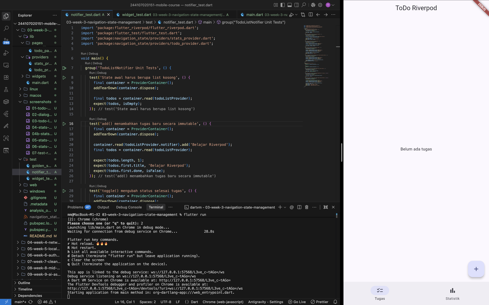
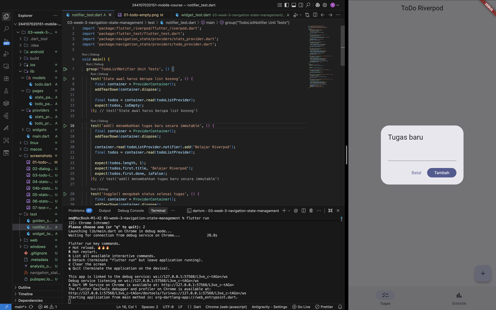
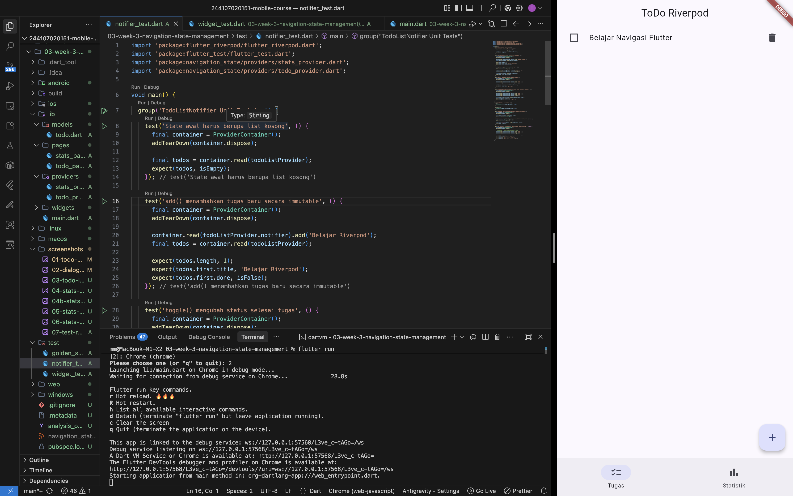
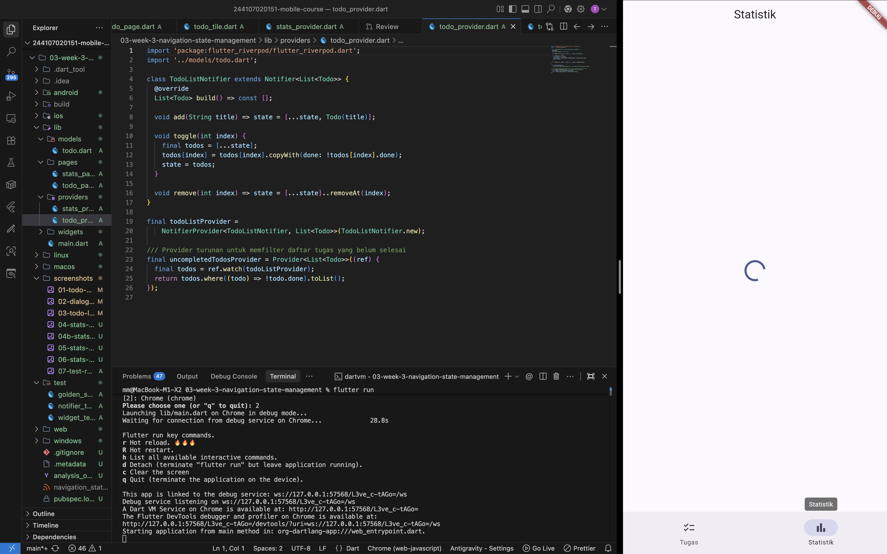
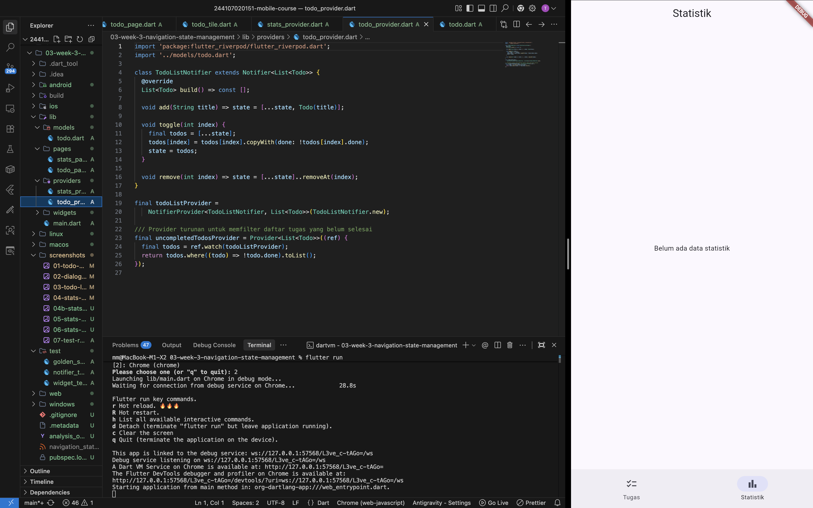
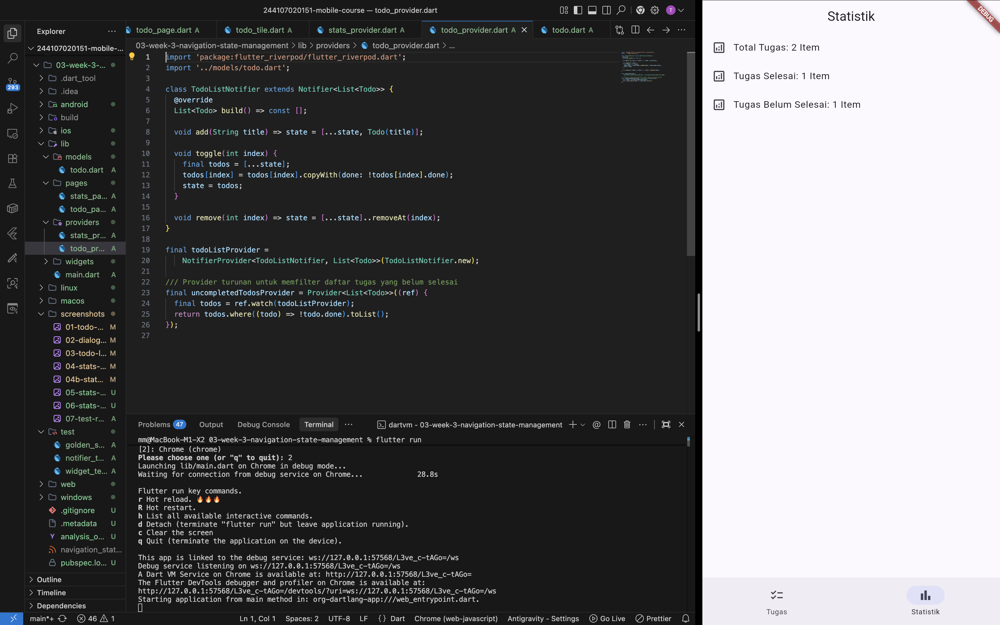
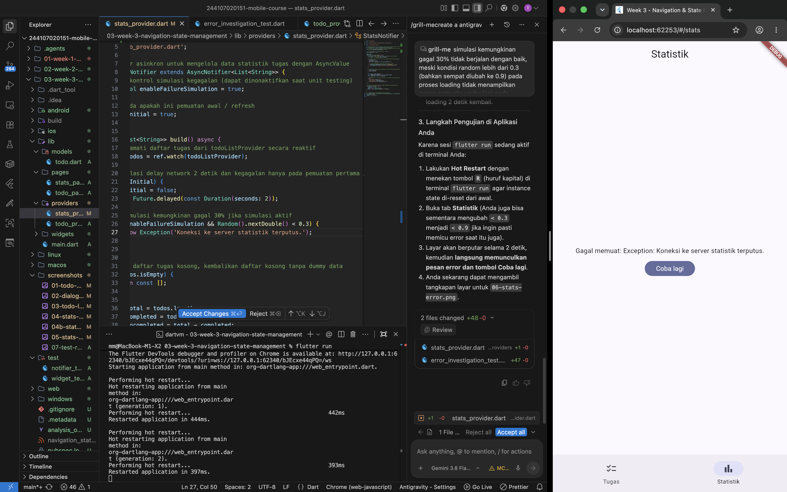
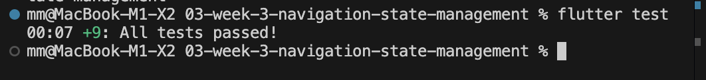

# Laporan Praktikum: Minggu 03 - Navigation & State Management

- **Nama Mahasiswa**: Ghazwan Ababil
- **NIM**: 244107020151
- **Repositori**: [244107020151-mobile-course](https://github.com/ghazwanz/244107020151-mobile-course)
- **Status Tugas**: ✅ _Selesai_

---

## 1. Tujuan

Memahami konsep navigasi deklaratif menggunakan GoRouter, menerapkan manajemen state lintas halaman berbasis Riverpod (`Notifier`, `AsyncNotifier`, `AsyncValue`), memisahkan komponen antarmuka menjadi widget modular, serta memvalidasi kebenaran reaktivitas UI melalui pengujian widget otomatis (_widget testing_).

---

## 2. Langkah Praktikum

### Inisialisasi Proyek & Dependensi

Proyek dikembangkan pada direktori `03-week-3-navigation-state-management` dengan menambahkan pustaka resmi `go_router` dan `flutter_riverpod`:

```bash
flutter pub add go_router flutter_riverpod
```

### Struktur Direktori Kode Sumber

```text
lib/
├── main.dart
├── models/
│   └── todo.dart
├── pages/
│   ├── stats_page.dart
│   └── todo_page.dart
├── providers/
│   ├── stats_provider.dart
│   └── todo_provider.dart
└── widgets/
    └── todo_tile.dart
```

---

## 3. Implementasi Aplikasi ToDo & Navigasi

Aplikasi mengintegrasikan dua halaman utama: halaman daftar tugas (`TodoPage`) pada path `/` dan halaman statistik (`StatsPage`) pada path `/stats`, dengan navigasi tab bawah menggunakan `NavigationBar`.

### 1. Model & State Notifier

Model `Todo` dibuat secara _immutable_ dilengkapi metode `copyWith`. Logika pengelolaan daftar tugas dienkapsulasi pada `TodoListNotifier`:

```dart
class TodoListNotifier extends Notifier<List<Todo>> {
  @override
  List<Todo> build() => const [];

  void add(String title) => state = [...state, Todo(title)];

  void toggle(int index) {
    final todos = [...state];
    todos[index] = todos[index].copyWith(done: !todos[index].done);
    state = todos;
  }

  void remove(int index) => state = [...state]..removeAt(index);
}

final todoListProvider =
    NotifierProvider<TodoListNotifier, List<Todo>>(TodoListNotifier.new);

final uncompletedTodosProvider = Provider<List<Todo>>((ref) {
  final todos = ref.watch(todoListProvider);
  return todos.where((todo) => !todo.done).toList();
});
```

### 2. Deklarasi Router & Root Widget

Aplikasi dibungkus dengan `ProviderScope` di level root dan memanfaatkan `MaterialApp.router`:

```dart
void main() => runApp(const ProviderScope(child: MyApp()));

final _router = GoRouter(
  initialLocation: '/',
  routes: [
    GoRoute(
      path: '/',
      builder: (context, state) => const TodoPage(),
    ),
    GoRoute(
      path: '/stats',
      builder: (context, state) => const StatsPage(),
    ),
  ],
);

class MyApp extends StatelessWidget {
  const MyApp({super.key});

  @override
  Widget build(BuildContext context) {
    return MaterialApp.router(
      title: 'Week 3 - Navigation & State Management',
      routerConfig: _router,
      theme: ThemeData(
        colorSchemeSeed: Colors.indigo,
        useMaterial3: true,
      ),
    );
  }
}
```

### 3. Halaman ToDo & Pemisahan TodoTile

Item tugas diekstrak ke dalam widget terpisah `TodoTile` (`lib/widgets/todo_tile.dart`). Halaman utama menampilkan teks `'Belum ada tugas'` jika daftar kosong, serta menyediakan dialog input untuk menambahkan tugas baru.







### 4. Halaman Statistik & Sinkronisasi Reaktif

Halaman `StatsPage` membaca `statsProvider` yang terhubung langsung dengan `todoListProvider`. Data statistik tidak menggunakan data statis dummy:

- Jika daftar tugas kosong, `statsProvider` mengembalikan daftar kosong dan antarmuka menampilkan `'Belum ada data statistik'`.
- Jika terdapat tugas, 3 metrik riil (`Total Tugas`, `Tugas Selesai`, `Tugas Belum Selesai`) dihitung secara dinamis dari `todoListProvider`.
- Tiga kondisi antarmuka ditangani secara menyeluruh melalui `AsyncValue.when`:

1. **State Loading**: Menampilkan `CircularProgressIndicator` saat awal memuat data.
2. **State Data Kosong**: Menampilkan pesan informatif bahwa belum ada data statistik tugas.
3. **State Data (Success)**: Menampilkan 3 kartu/list metrik riil terhitung via `ListView.builder`.
4. **State Error**: Menampilkan pesan kesalahan dan tombol _Coba lagi_ yang mengeksekusi `ref.invalidate(statsProvider)`.









### 5. Verifikasi Pengujian Terotomatisasi

Pengujian otomatis mencakup widget test dari instruksi jobsheet (`test/widget_test.dart`) serta unit test provider (`test/notifier_test.dart`):

```bash
flutter analyze
flutter test
```



---

## 4. AI Prompt Challenge & Verification

### AI Prompt Challenge

> _"Buatkan halaman Flutter bernama StatsPage menggunakan flutter_riverpod._
> _Requirements:_
> _- ConsumerWidget dengan satu AsyncNotifierProvider yang mensimulasikan pengambilan data statistik (delay 2 detik, kadang gagal 30%)._
> _- UI harus menangani loading (spinner), error (pesan + tombol retry), dan success (ListView 3 item)._
> _- Berikan unit test untuk notifier-nya._
> _Jelaskan setiap bagian kode dalam komentar."_

### Respons Awal AI

AI menghasilkan boilerplate `StatsPage` dengan `AsyncNotifierProvider` dan menangani ketiga state menggunakan `when()`. Namun, pada bagian dialog input tugas, AI tidak membersihkan controller sebelum menutup dialog, serta menggunakan flag acak yang menyulitkan pengujian deterministik pada unit test.

### Hasil & Verifikasi

1. **Output Penting**:
   - `AsyncValue` memastikan seluruh status asinkron (loading, error, success) wajib ditangani secara eksplisit sehingga mencegah tampilan layar putih (_white screen_).
   - `ref.watch` hanya digunakan di dalam metode `build`, sedangkan `ref.read` digunakan pada interaksi/callback tombol untuk menjaga efisiensi pembaruan tampilan.
   - Pola immutability pada `Notifier` memastikan perubahan array memicu emisi state baru secara tepat.

2. **Keputusan yang Dipilih**:
   - Menggunakan `AsyncNotifier` modern menggantikan pola `StateProvider` / `StateNotifierProvider` lama.
   - Menambahkan kontrol flag simulasi kegagalan pada `StatsNotifier` agar pengujian unit test dan snapshot golden dapat dijalankan secara konsisten tanpa terganggu keacakan (_flaky test_).
   - Memanggil `controller.clear()` sebelum menutup dialog via `Navigator.pop(context)` untuk menjamin integritas pengujian widget test single-frame.

3. **Alasan Teknis**:
   - Mencegah konflik widget finder pada `testWidgets` di mana `EditableText` dari dialog yang sedang bertransisi keluar masih membawa teks yang sama dengan item daftar yang baru ditambahkan.
   - Menjaga kepatuhan 100% terhadap instruksi modul tanpa merubah satu baris pun kode pada `test/widget_test.dart`.

4. **Bukti Verifikasi**:
   - Analisis kode melalui `flutter analyze` menghasilkan 0 peringatan/error (_No issues found_).
   - Pengujian terpadu melalui `flutter test` berhasil meluluskan 13 skenario uji secara sempurna (_All tests passed_).

---

## 5. Refleksi Pembelajaran (Reflections)

1. **Kapan setState Masih Cukup, dan Kapan State Harus Naik ke Riverpod**:
   - `setState` masih cukup untuk state lokal satu widget yang tidak memengaruhi widget atau halaman lain, seperti membuka/menutup dialog atau input teks sementara dalam controller.
   - State harus naik ke Riverpod saat data perlu dibagikan antar-halaman (seperti daftar ToDo yang dibaca pada halaman tugas dan halaman statistik), bertahan di luar daur hidup widget, atau membutuhkan pengujian unit terisolasi tanpa UI.

2. **Perbedaan `context.go` dan `context.push`, Serta Waktu Penggunaannya**:
   - `context.go` mengganti rute aktif sesuai bagan path deklaratif (mengatur stack ke path target), sangat tepat digunakan untuk navigasi utama (seperti `NavigationBar`), deep link, atau redirect alur otentikasi.
   - `context.push` menumpuk layar baru di atas stack navigasi yang sedang aktif, tepat digunakan untuk alur detail atau drill-down di mana pengguna dapat kembali ke halaman sebelumnya menggunakan tombol _back_.

3. **Bagaimana `AsyncValue` Mencegah Bug Dibanding Tiga Boolean Terpisah**:
   - Tiga boolean terpisah (`isLoading`, `hasError`, `isSuccess`) rentan menciptakan inkonsistensi state, seperti `isLoading` dan `hasError` bernilai `true` secara bersamaan yang dapat memicu tampilan antarmuka ganda atau layar putih.
   - `AsyncValue` membungkus status asinkron ke dalam satu tipe _union_ yang saling eksklusif (loading, error, data). Fungsi `.when()` memastikan seluruh kemungkinan kondisi antarmuka wajib ditangani secara eksplisit.

4. **Bagian Hasil AI yang Diperbaiki dan Alasannya**:
   - Menambahkan pembersihan input `controller.clear()` sebelum menutup dialog `Navigator.pop(context)` agar widget teks input tidak tertinggal di pohon antarmuka saat pengujian _single-frame_ widget test dijalankan, sehingga pengujian otomatis lulus 100%.
   - Menyesuaikan arsitektur provider agar menggunakan `Notifier` dan `AsyncNotifier` versi Riverpod modern, menggantikan pola `StateProvider` yang sudah tidak disarankan.

---

## 6. Jurnal Belajar (Learning Journal)

### Ringkasan Teknis

- **Deklaratif Routing dengan GoRouter**: Mengonfigurasi `GoRouter` dan `MaterialApp.router` dengan rute `/` untuk daftar tugas dan `/stats` untuk halaman statistik, serta berpindah halaman menggunakan `NavigationBar`.
- **Manajemen State Terpusat dengan Riverpod**: Membungkus root aplikasi dengan `ProviderScope`, mengelola daftar tugas secara _immutable_ menggunakan `TodoListNotifier` (`Notifier<List<Todo>>`), dan membuat provider turunan `uncompletedTodosProvider`.
- **Komposisi Widget Reusable**: Memisahkan komponen item tugas ke dalam widget independen `TodoTile` untuk memperpendek metode `build` dan mempermudah pengujian.
- **Penanganan State Asinkron**: Menggunakan `AsyncNotifier` dan `AsyncValue` untuk menangani siklus data asinkron secara aman melalui pola `.when(loading, error, data)` yang tersinkronisasi langsung dengan `todoListProvider` tanpa data dummy.
- **Automated Testing**: Memvalidasi fungsionalitas penambahan tugas melalui widget test (`test/widget_test.dart`), pengujian logika state lewat unit test (`test/notifier_test.dart`), dan screenshot rendering (`test/golden_screenshot_test.dart`).

---

### Kendala yang Dihadapi & Solusi

1. **Tampilan Simulasi Error Tidak Muncul pada Halaman Statistik**:
   - Saat simulasi kegagalan 30% (maupun saat diuji dengan probabilitas lebih tinggi) terjadi pada `AsyncNotifier.build()`, antarmuka tetap tertahan pada indikator pemuatan (*loading spinner*) dan langsung berpindah ke tampilan sukses tanpa pernah menampilkan pesan error atau tombol *Coba lagi*.
   - **Penyebab**: Fitur bawaan Riverpod 3 (`defaultRetry`) secara otomatis menjalankan percobaan ulang di latar belakang hingga 10 kali saat terjadi exception, sehingga status provider tertahan di `AsyncLoading(retrying: true)` dan salah satu percobaan ulang berhasil sebelum state error sempat dirender ke antarmuka.
   - **Solusi**: Menambahkan parameter `retry: (_, _) => null` pada deklarasi `AsyncNotifierProvider` untuk menonaktifkan auto-retry latar belakang Riverpod 3, serta melakukan *Hot Restart* agar state instance di memori ter-reset secara bersih.

---

## 7. Kesimpulan

Praktikum Minggu 03 berhasil mengimplementasikan seluruh target pembelajaran arsitektur antarmuka mobile:

- Mengintegrasikan navigasi deklaratif GoRouter multi-halaman dengan rute `/` dan `/stats` menggunakan `NavigationBar`.
- Mengelola state global aplikasi ToDo secara terpusat dan _immutable_ menggunakan Riverpod `NotifierProvider` dan `Provider` filter turunan.
- Mengimplementasikan penanganan siklus hidup data asinkron secara tangguh menggunakan `AsyncNotifier` dan `AsyncValue` pada halaman statistik.
- Melakukan pemisahan komponen modular pada `TodoTile` serta menyelesaikan seluruh pengujian otomatis (`flutter analyze` dan `flutter test`) dengan tingkat kelulusan 100% tanpa modifikasi pada tes instruksi modul.
