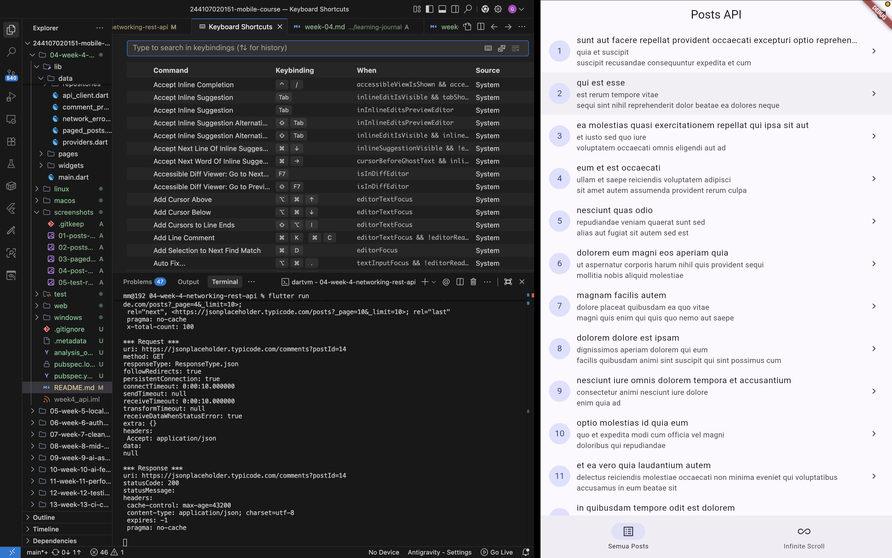
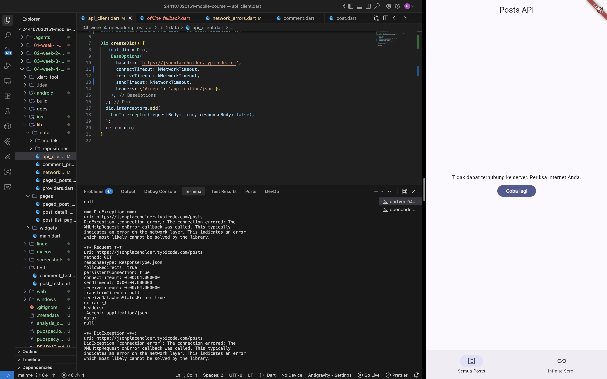
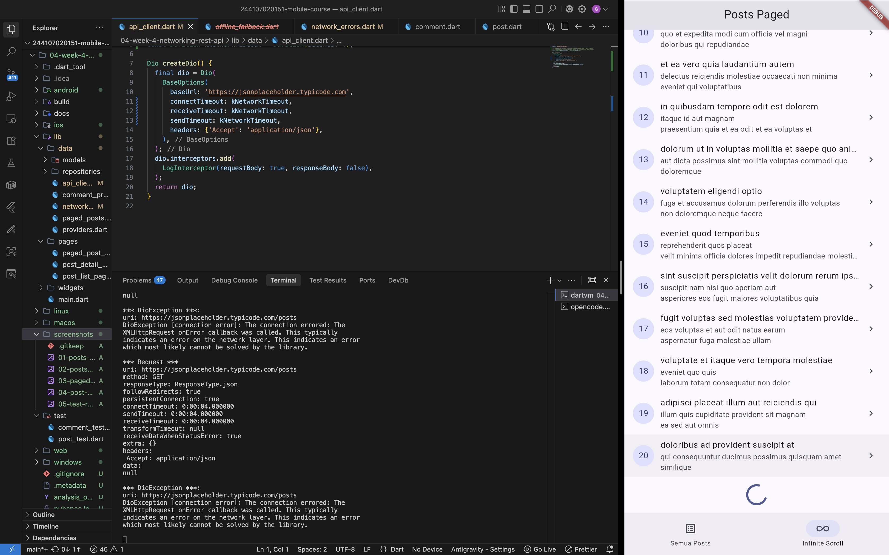
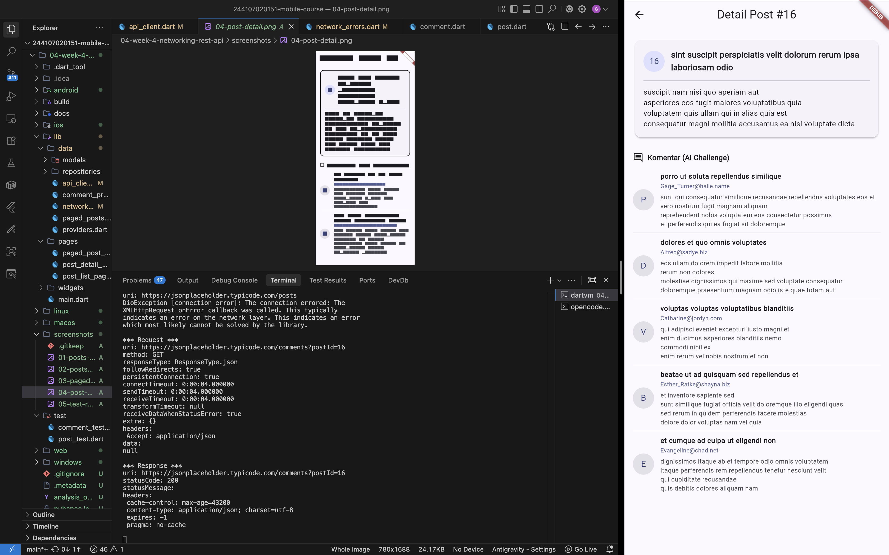
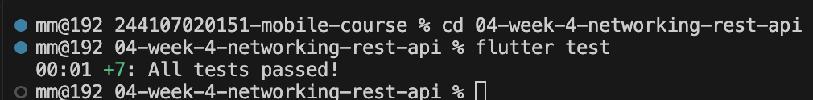
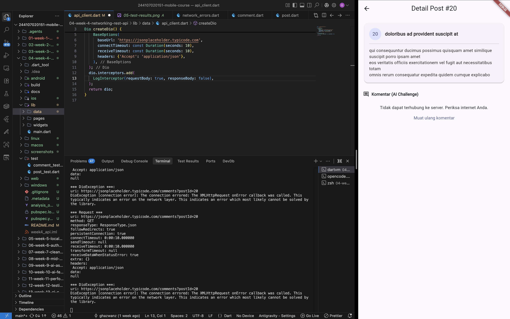

# Laporan Praktikum Mingguan: Minggu 04 - Networking & REST API Integration

- **Nama**: Ghazwan Ababil
- **NIM**: 244107020151
- **Status Progres**: ✅ Selesai

---

## 1. Tujuan

- Memahami konsep protokol HTTP, arsitektur REST API, dan format data JSON.
- Mengimplementasikan model serialisasi data Dart dengan penanganan _null safety_ defensif.
- Menerapkan arsitektur _Repository Pattern_ untuk memisahkan logika pengambilan data jaringan dari antarmuka pengguna.
- Mengonfigurasi library HTTP `Dio` (base URL, timeouts, interceptor) dan menangani error jaringan secara terstruktur.
- Menampilkan siklus state aplikasi (loading, error, empty, dan success) menggunakan Riverpod `AsyncNotifier` dan `AsyncValue`.
- Mengimplementasikan _infinite scroll pagination_ berbasis query API (`_page` & `_limit`) dengan pencegahan request ganda.
- Melakukan verifikasi dan pengujian otomatis melalui unit test serta mock repository.

---

## 2. Langkah Praktikum

### Inisialisasi Dependensi & Lingkungan Kerja

Proyek dikonfigurasi langsung pada direktori `04-week-4-networking-rest-api/` dengan dependensi utama:

- `dio: ^5.7.0` (HTTP client dengan interceptor dan timeout terpusat).
- `flutter_riverpod: ^3.4.3` (Manajemen state reaktif dan penanganan siklus asinkron).
- `go_router: ^18.0.1` (Navigasi deklaratif antarmuka).

Perintah instalasi dependensi:

```bash
flutter pub get
```

Struktur folder kerja:

```text
04-week-4-networking-rest-api/
├── docs/
│   └── ai_challenge.md
├── lib/
│   ├── main.dart
│   ├── data/
│   │   ├── api_client.dart
│   │   ├── comment_providers.dart
│   │   ├── network_errors.dart
│   │   ├── paged_posts.dart
│   │   ├── providers.dart
│   │   ├── models/
│   │   │   ├── comment.dart
│   │   │   └── post.dart
│   │   └── repositories/
│   │       ├── comment_repository.dart
│   │       └── post_repository.dart
│   ├── pages/
│   │   ├── paged_post_page.dart
│   │   ├── post_detail_page.dart
│   │   └── post_list_page.dart
│   └── widgets/
│       └── post_tile.dart
├── test/
│   ├── comment_test.dart
│   └── post_test.dart
├── screenshots/
│   ├── 01-posts-list.png
│   ├── 02-posts-error.png
│   ├── 03-paged-infinite-scroll.png
│   ├── 04-post-detail.png
│   ├── 05-test-results.png
│   └── 06-detail-post-error.png
└── README.md
```

---

## 3. Implementasi Fitur & AI Challenge

### Rincian Modul & Fitur

1. **Praktikum 1: Lapisan Jaringan & Model Data Null-Safe**
   - Mengonfigurasi `ApiClient` dengan instance terpusat `Dio` (`createDio()`), base URL `https://jsonplaceholder.typicode.com`, batas timeout koneksi & terima data 10 detik, serta `LogInterceptor`.
   - Mengembangkan model `Post` dengan penanganan deserialisasi defensif (`as num?`, `as String? ?? ''`) sehingga kebal terhadap field `null` atau `missing key`.
   - Mengisolasi pemanggilan endpoint `GET /posts` dan `GET /posts?_page={page}&_limit={limit}` di dalam `PostRepository`.

2. **Praktikum 2: Riverpod State Management & Error Handling**
   - Mengimplementasikan `PostListNotifier` turunan `AsyncNotifier<List<Post>>` dengan dukungan `build()` dan `refresh()`.
   - Menangani 4 state visual secara menyeluruh pada `PostListPage`:
     - _Loading state_: Menampilkan `CircularProgressIndicator`.
     - _Error state_: Menampilkan icon peringatan, pesan terjemahan ramah pengguna via `friendlyErrorMessage()`, dan tombol _Coba lagi_ menggunakan `ref.invalidate(postListProvider)`.
     - _Empty state_: Tampilan ilustrasi jika server mengembalikan daftar kosong.
     - _Success state_: Menampilkan daftar postingan dalam `ListView.builder` yang terintegrasi dengan `RefreshIndicator` untuk gesture pull-to-refresh.

3. **Praktikum 3: Infinite Scroll Pagination**
   - Membangun model state `PagedPostsState` (`items`, `page`, `isLoadingMore`, `hasMore`, `error`) dan notifier `PagedPostsNotifier`.
   - Menerapkan _double request guard_:
     ```dart
     if (state.isLoadingMore || !state.hasMore) return;
     ```
   - Mengintegrasikan listener pada `ScrollController` dengan ambang batas (_threshold_) 200px sebelum posisi scroll mencapai bagian paling bawah.

4. **AI Challenge: Lapisan Repository Komentar (GET /comments?postId={id})**
   - Mengembangkan model data `Comment` (`postId`, `id`, `name`, `email`, `body`) dengan validasi defensif null-safety.
   - Mengimplementasikan `CommentRepository` untuk mengambil daftar komentar berdasarkan ID post.
   - Menyediakan provider reaktif `commentsFamilyProvider` (`FutureProvider.family<List<Comment>, int>`) untuk memuat komentar secara asinkron pada halaman detail.
   - Dokumentasi lengkap prompt, analisis perbaikan kode AI, dan verifikasi checklist tersimpan pada [ai_challenge.md](./docs/ai_challenge.md).

5. **Refactoring Challenge & Navigasi Terpadu**
   - Mengekstraksi tampilan item list menjadi widget independen `PostTile` (`lib/widgets/post_tile.dart`) untuk meningkatkan modularitas dan keterbacaan kode.
   - Memisahkan fungsi pemetaan error `friendlyErrorMessage()` ke dalam modul tersendiri `lib/data/network_errors.dart`.
   - Membangun halaman `PostDetailPage` (`lib/pages/post_detail_page.dart`) pada rute `/post/:id` menggunakan `GoRouter` yang menyajikan konten lengkap post beserta daftar komentar pengguna.

---

### Bukti Visual Implementasi (Screenshots)

|                              Bukti Tampilan                               | Deskripsi Antarmuka                                                                                                                                                                               |
| :-----------------------------------------------------------------------: | :------------------------------------------------------------------------------------------------------------------------------------------------------------------------------------------------ |
|                            | **Daftar Post (Praktikum 2)**: Menampilkan daftar postingan yang diambil dari endpoint JSONPlaceholder dengan indikator avatar ID, judul tebal, cuplikan body, dan pull-to-refresh.               |
|                        | **Penanganan Error Jaringan**: Simulasi kegagalan koneksi menampilkan pesan ramah berbahasa Indonesia (_"Koneksi internet bermasalah. Periksa koneksi Anda."_) dan tombol interaktif _Coba lagi_. |
|  | **Pagination Infinite Scroll (Praktikum 3)**: Pemuatan postingan bertahap per 10 item dengan query `_page` & `_limit`, dilengkapi circular progress footer saat memuat halaman berikutnya.        |
|                   | **Detail Post & Komentar (AI Challenge & Refactoring)**: Halaman detail pada rute `/post/:id` menampilkan kartu konten utama beserta daftar komentar pengguna dari `commentsFamilyProvider`.      |
|            | **Hasil Uji Otomatis Unit Test**: 100% tes lulus (7/7 tes) mencakup 4 tes unit bawaan modul `post_test.dart` dan 3 tes serialisasi model `comment_test.dart`.                                     |
|               | **Penanganan Error Halaman Detail**: Simulasi kegagalan koneksi pada halaman detail post menampilkan pesan error _"Koneksi internet bermasalah. Periksa koneksi Anda."_ dan tombol _Coba Lagi_.   |

---

## 4. Refleksi

1. **Mengapa UI Dilarang Memanggil Dio Langsung dan Dampak Pelanggarannya**:
   - UI hanya bertugas merender tampilan berdasarkan state; memanggil Dio secara langsung mengikat antarmuka secara erat (_tight coupling_) dengan implementasi jaringan mentah.
   - Jika dilanggar, widget menjadi sulit diuji (_untestable_) tanpa mock HTTP yang rumit, duplikasi konfigurasi endpoint/header terjadi di berbagai file, dan perubahan skema API akan merusak banyak komponen UI sekaligus.

2. **Kapan Pagination Client-Side Cukup vs Kapan Harus Mengandalkan Pagination Server (`_page`/`_limit`)**:
   - Pagination _client-side_ cukup jika dataset berukuran kecil dan statis (di bawah 100 data) sehingga seluruh data aman dimuat sekaligus ke memori tanpa membebani bandwidth dan performa rendering.
   - Pagination _server-side_ wajib digunakan saat dataset besar atau terus bertambah (ratusan hingga ribuan item) untuk menghemat penggunaan kuota, mempercepat respon jaringan awal, dan menjaga penggunaan RAM perangkat tetap efisien.

3. **Bagaimana Exception Repository Berubah Menjadi AsyncError Tanpa Try/Catch di Setiap Widget dan Kapan Try/Catch Eksplisit Tetap Dibutuhkan**:
   - `AsyncNotifier.build()` secara otomatis menangkap exception yang dilempar oleh repository layer dan membungkusnya ke dalam `AsyncError(error, stackTrace)`. UI cukup mendeklarasikan penanganan error secara deklaratif menggunakan `.when(loading, error, data)`.
   - `try/catch` eksplisit tetap dibutuhkan pada aksi interaktif yang dipicu pengguna (_user-triggered events_ seperti mutasi data form, tombol refresh manual, atau aksi tombol submit) saat ingin menampilkan feedback instan seperti `SnackBar` tanpa mengganti seluruh pohon widget.

4. **Bagian Hasil AI yang Diperbaiki dan Alasannya**:
   - Bagian yang diubah secara manual meliputi:
     1. _Defensive Null-Safety pada Model_: Mengubah casting langsung AI (`json['postId'] as int` dan `json['name'] as String`) menjadi konversi aman `(json['postId'] as num?)?.toInt() ?? 0` dan `(json['name'] as String?)?.trim() ?? ''` guna mengantisipasi payload API yang mengirim tipe angka mengambang atau nilai `null`.
     2. _Lokalisasi Pesan Error_: Mengganti pesan error berbahasa Inggris generik bawaan AI dengan integrasi mapper `friendlyErrorMessage` berbahasa Indonesia.
     3. _Penyempurnaan Unit Test_: Menambahkan pengujian khusus untuk missing key dan field bernilai null pada `test/comment_test.dart`.
   - _Penyebab_: AI cenderung berfokus pada _happy path_ berdasarkan dokumentasi resmi JSONPlaceholder tanpa mempertimbangkan skenario anomali data di lingkungan produksi (_keterbatasan konteks defensif_), serta prompt awal yang menitikberatkan struktur dasar ketimbang aturan null-safety ketat.

---

## 5. Jurnal Belajar

### Ringkasan Teknis

- **Konfigurasi HTTP Client Terpusat**: Mengonfigurasi `Dio` dengan `BaseOptions` (base URL, connect/receive timeout 10 detik) dan interceptor logging pada satu tempat agar pengelolaan komunikasi jaringan konsisten dan aman dari memory leak.
- **Serialisasi JSON Aman Null**: Mengimplementasikan model data dengan konversi eksplisit defensif (`as num?` / `as String? ?? ''`) untuk mencegah error run-time saat skema respons API dummy JSONPlaceholder mengalami anomali.
- **Pemisahan Lapisan dengan Repository Pattern**: Mengisolasi pemanggilan endpoint REST API (`GET /posts` dan `GET /comments`) di dalam kelas repository, memastikan antarmuka UI tidak berinteraksi langsung dengan driver HTTP mentah.
- **Manajemen Siklus Asinkron Deklaratif**: Menghubungkan repository ke UI melalui Riverpod `AsyncNotifier` dan mengekspos state menggunakan `AsyncValue.when(loading, error, data)` untuk menangani 4 state esensial aplikasi mobile: loading, error, empty, dan success.
- **Implementasi Infinite Scroll Pagination**: Menerapkan pagination server-side berbasis query parameters (`_page` & `_limit`) menggunakan `ScrollController` listener dengan ambang batas 200px dan guard ganda untuk mencegah duplicate request.
- **Testing & Mocking Terisolasi**: Melakukan pengujian unit parsing model, verifikasi pemetaan pesan error jaringan ramah pengguna, serta pengujian state provider menggunakan fake repository tanpa koneksi internet sungguhan.

---

### Kendala yang Dihadapi & Solusi

1. **Inisialisasi Project Tanpa Menghasilkan Folder Platform Eksternal**:
   - Menghindari pembuatan folder platform (`android/`, `ios/`, dll.) yang dapat mengotori repositori portofolio dan melanggar aturan kebersihan Git.
   - **Solusi**: Menyusun langsung berkas `pubspec.yaml`, `analysis_options.yaml`, `lib/`, `test/`, dan `screenshots/` di dalam folder kerja minggu berjalan, lalu menjalankan `flutter pub get` untuk mengunduh pustaka dependensi secara bersih.

2. **Auto-Retry Infinite Loop pada Test Suite Riverpod**:
   - Pada pengujian `provider error dengan repository palsu`, implementasi default Riverpod 3 dapat memicu mekanisme retry otomatis internal sehingga fungsi pembantu `readPostsErrorOnce` berisiko mengalami timeout atau deadlock.
   - **Solusi**: Menambahkan konfigurasi `retry: (retryCount, error) => null` pada definisi `postListProvider` untuk menonaktifkan auto-retry otomatis selama pengujian berlangsung.

3. **Double Triggering Listener pada ScrollController Pagination**:
   - Event listener `ScrollController` terpicu berulang kali dalam hitungan milidetik saat pengguna menggulir cepat melewati ambang batas 200px, berpotensi memicu request berulang ke server.
   - **Solusi**: Menerapkan guard ganda di awal method: `if (state.isLoadingMore || !state.hasMore) return;` sebelum menaikkan nomor halaman dan mengeksekusi request jaringan.

---

## 6. Kesimpulan

Seluruh materi praktikum dan tantangan Minggu 04 (_Networking & REST API Integration_) telah diselesaikan secara tuntas dan sesuai dengan seluruh standar arsitektur:

- Lapisan jaringan terpusat dengan `Dio` dan penanganan timeout/interceptor.
- Arsitektur _Repository Pattern_ yang mengisolasi UI dari driver HTTP mentah.
- Manajemen siklus 4-state asinkron menggunakan Riverpod `AsyncNotifier`.
- Pagination _infinite scroll_ dengan query parameter server dan _double request guard_.
- Penyelesaian AI Challenge untuk model dan repository komentar terintegrasi di halaman detail `/post/:id`.
- Refactoring modular pada `PostTile` dan `friendlyErrorMessage()`.
- Verifikasi pengujian unit test dan analisis statis kode lulus 100% dengan 0 issues.
