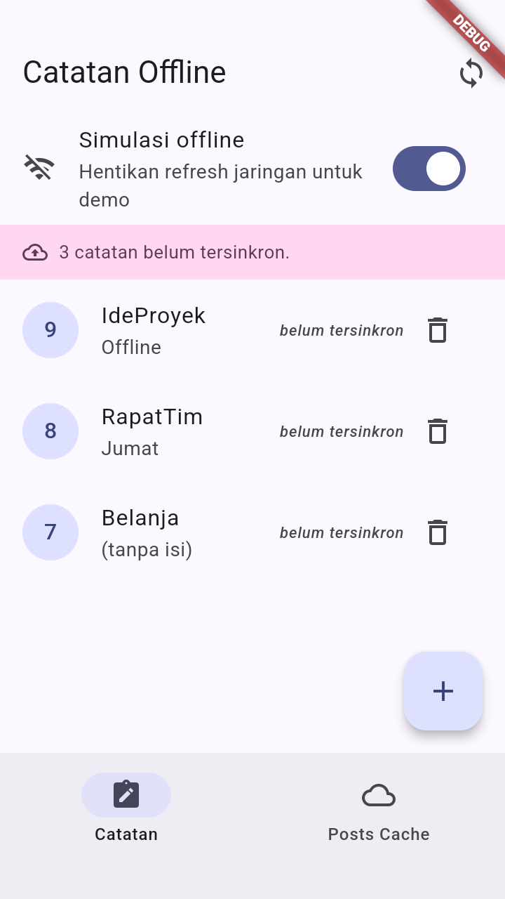
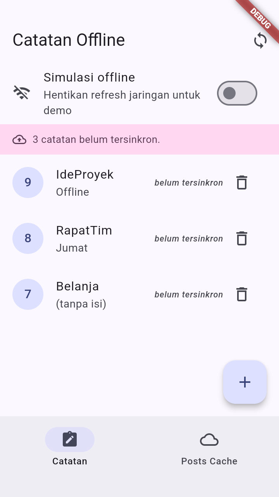
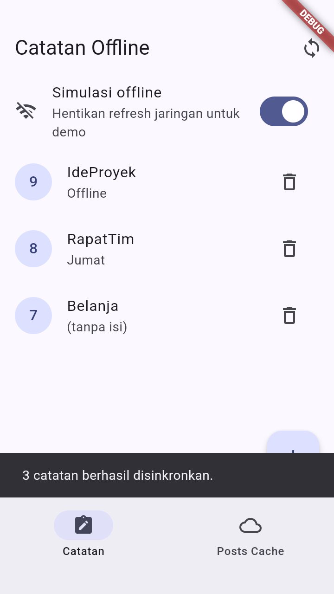
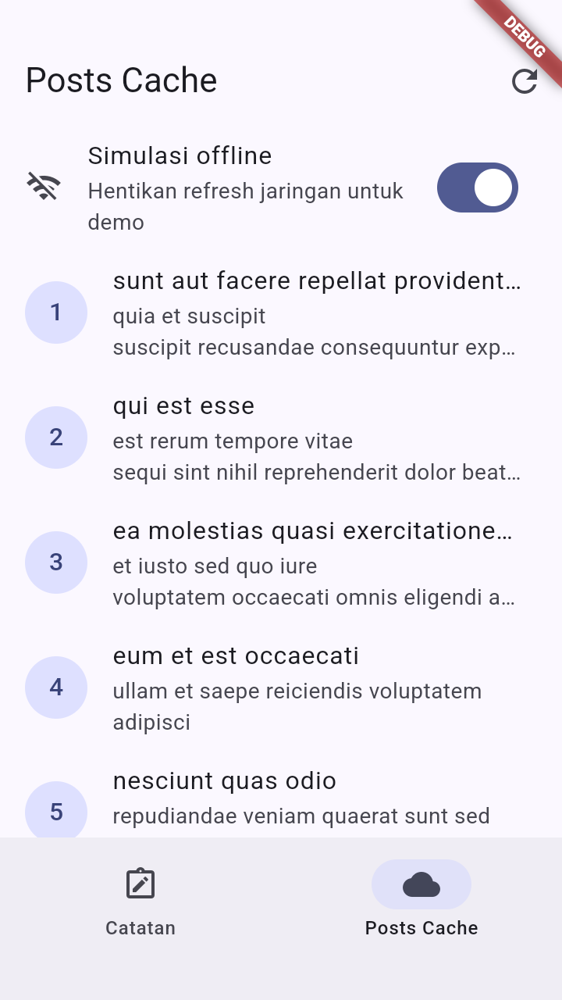
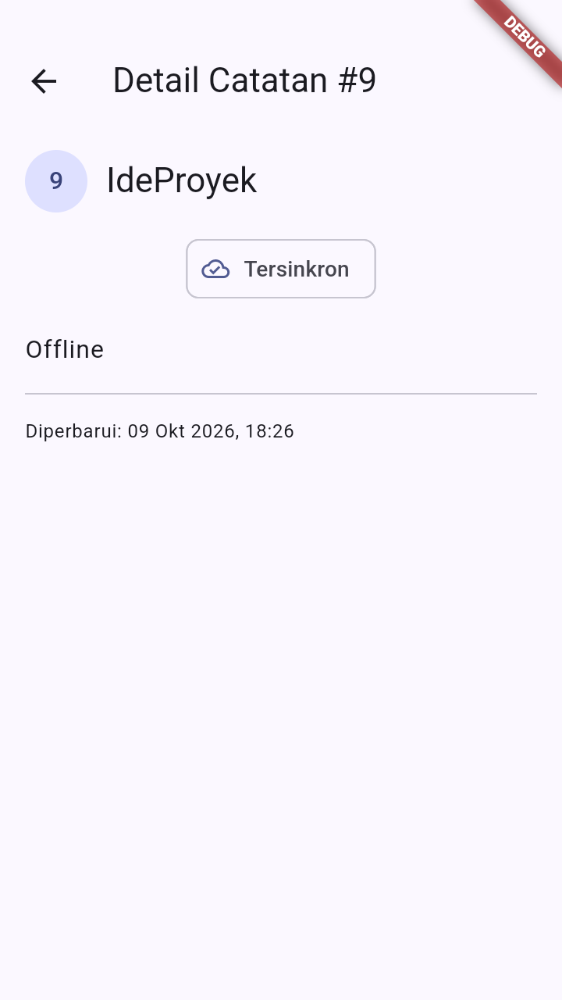
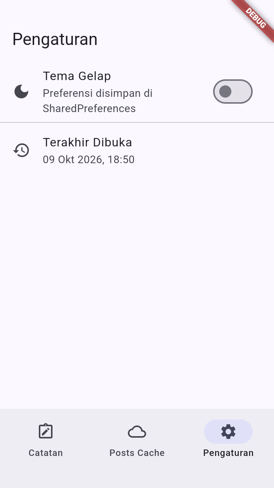
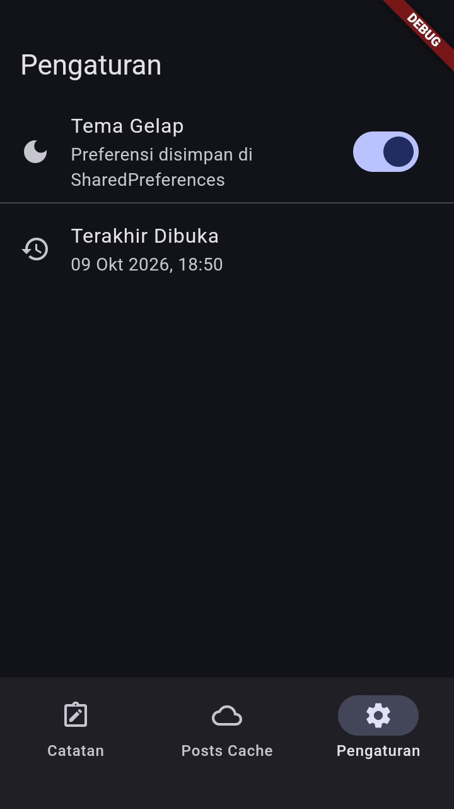

# Laporan Praktikum Mingguan: Minggu 05 - Local Storage & Offline-First Architecture

- **Nama**: Ghazwan Ababil
- **NIM**: 244107020151
- **Status Progres**: ✅ Selesai

---

## 1. Tujuan

- Menjelaskan perbedaan penyimpanan key-value, relasional, dan NoSQL di perangkat.
- Menyimpan preferensi sederhana (tema, terakhir dibuka) dengan `SharedPreferences`.
- Menerapkan CRUD catatan dengan SQLite (`sqflite`) melalui repository lokal.
- Menerapkan pola offline-first: cache-first read, dirty flag, dan antrean sinkronisasi.
- Menampilkan state loading, error, empty, dan success untuk data lokal dengan Riverpod.
- Menguji repository lokal dengan repository palsu tanpa database sungguhan.

---

## 2. Langkah Praktikum

### Inisialisasi Project & Dependensi

Project dibuat langsung di dalam folder `05-week-5-local-storage-offline-first/` dengan nama package `week5_offline_notes`, tanpa mengubah nama folder.

Perintah inisialisasi dan instalasi dependensi:

```bash
flutter create --project-name week5_offline_notes --org com.example .
flutter pub add flutter_riverpod shared_preferences sqflite path
```

Dependensi utama:

- `flutter_riverpod: ^3.4.3` (manajemen state reaktif dan `AsyncValue`).
- `shared_preferences: ^2.5.6` (penyimpanan key-value untuk preferensi).
- `sqflite: ^2.4.4+1` (database relasional lokal untuk catatan).
- `path: ^1.9.1` (penyusunan path database).
- `go_router: ^18.0.2` (navigasi deklaratif untuk rute detail `/note/:id`).

Struktur folder kerja:

```text
05-week-5-local-storage-offline-first/
├── docs/
│   └── ai_challenge.md
├── lib/
│   ├── main.dart
│   ├── data/
│   │   ├── api_client.dart
│   │   ├── prefs.dart
│   │   ├── sync.dart
│   │   ├── local/
│   │   │   ├── db.dart
│   │   │   └── note.dart
│   │   ├── models/
│   │   │   └── post.dart
│   │   └── repositories/
│   │       └── note_repository.dart
│   ├── pages/
│   │   ├── note_detail_page.dart
│   │   ├── notes_page.dart
│   │   ├── posts_page.dart
│   │   └── settings_page.dart
│   ├── utils/
│   │   └── date_format.dart
│   └── widgets/
│       ├── note_tile.dart
│       └── offline_toggle.dart
├── test/
│   └── note_test.dart
├── screenshots/
└── README.md
```

---

## 3. Implementasi Fitur & AI Challenge

### Praktikum 1: Preferensi dengan SharedPreferences

1. **Repository Preferensi (`lib/data/prefs.dart`)**
   - `PrefsRepository` memusatkan seluruh akses key-value `SharedPreferences` pada satu tempat, bukan tersebar di widget.
   - Menyediakan `getDarkMode`/`setDarkMode` (kunci `dark_mode`) serta `markOpenedNow`/`getLastOpened` (kunci `last_opened_at`).

2. **Provider & Notifier Tema (`lib/pages/settings_page.dart`)**
   - `prefsRepositoryProvider` menyediakan instance `PrefsRepository`.
   - `darkModeProvider` (`AsyncNotifierProvider<DarkModeNotifier, bool>`) membaca preferensi tema secara asinkron melalui `DarkModeNotifier.build()`.
   - Method `toggle()` membalik nilai tema dan menyimpannya dengan pola `AsyncValue.guard`.

   > Catatan: kode `prefs.dart` dan provider/notifier disalin persis dari modul. Karena modul tidak menyertakan widget halaman, file `settings_page.dart` masih memicu warning `unused_import` (import `material.dart` belum terpakai) dan warning ini sengaja dipertahankan sesuai keputusan.

### Praktikum 2: SQLite dan Repository Catatan

1. **Model Catatan (`lib/data/local/note.dart`)**
   - Kelas `Note` dengan field `id`, `title`, `body`, `updatedAt`, dan `dirty`.
   - `toMap()`/`fromMap()` defensif null; field `dirty` disimpan sebagai integer (`1`/`0`) sebagai penanda antrean sinkronisasi.

2. **Pembuka Database (`lib/data/local/db.dart`)**
   - Fungsi tunggal `openNotesDb()` dipakai seluruh repository.
   - Membuat dua tabel pada `onCreate`: `notes` (id autoincrement, title, body, updated_at, dirty) dan `cached_posts` (id, payload, cached_at).

3. **Repository Catatan (`lib/data/repositories/note_repository.dart`)**
   - Constructor menerima `openDb` opsional agar test dapat menyuntikkan database palsu/in-memory tanpa menyentuh SQLite sungguhan.
   - Menyediakan `fetchNotes` (urut `updated_at DESC`), `addNote` (otomatis `dirty: true`), `deleteNote`, `countDirty`, dan `markAllSynced`.

### Praktikum 3: Cache-First & Antrean Sinkronisasi

1. **Dukungan Jaringan & Model Post** (`lib/data/api_client.dart`, `lib/data/models/post.dart`)
   - Menambahkan dependensi `dio` dan model `Post` (dipakai ulang dari Minggu 4) karena `loadPostsCacheFirst` mengembalikan `List<Post>` dan memakai Dio.
   - `createDio()` mengonfigurasi base URL JSONPlaceholder, timeout, dan `LogInterceptor`.

2. **Logika Cache-First & Sinkronisasi** (`lib/data/sync.dart`)
   - `readCachedPosts()` membaca tabel `cached_posts` dan memetakannya kembali menjadi `Post`.
   - `saveCachedPosts()` menyimpan hasil fetch ke cache (upsert per `id`).
   - `PostsCacheNotifier` mengimplementasikan alur cache-first: `loadPostsCacheFirst()` mengembalikan cache seketika lalu memanggil `refreshPostsInBackground()`; jika gagal/offline, cache lama tetap tampil.
   - `syncNotes(NoteRepository)` menghitung `countDirty`, mensimulasikan upload dengan delay, lalu memanggil `markAllSynced`.

3. **Toggle Simulasi Offline** (`lib/data/sync.dart`)
   - `forceOfflineProvider` (`NotifierProvider<ForceOfflineNotifier, bool>`) menyediakan toggle deterministik agar demo/testing tidak bergantung pada kondisi Wi-Fi; saat aktif, `refreshPostsInBackground()` berhenti lebih awal.

### Halaman Aplikasi

1. **Halaman Catatan (`lib/pages/notes_page.dart`)**
   - Menampilkan daftar catatan dari `notesProvider` (repository lokal) dengan empat state: loading, error, empty, dan success.
   - Tambah catatan lewat `AlertDialog` (judul + isi), hapus dengan konfirmasi, dan pull-to-refresh.
   - Banner "`N catatan belum tersinkron.`" muncul saat ada catatan `dirty`, dan tombol sinkron memanggil `syncNotes` lalu menampilkan `SnackBar`.

2. **Halaman Posts Cache (`lib/pages/posts_page.dart`)**
   - Menampilkan hasil cache-first dari `postsCacheProvider`; tombol refresh memicu `refreshPostsInBackground()`.

3. **Halaman Pengaturan (`lib/pages/settings_page.dart`)**
   - `SettingsPage` memakai `darkModeProvider` untuk toggle tema gelap/terang dan `lastOpenedProvider` untuk menampilkan waktu terakhir dibuka.
   - Nilai waktu diformat lewat helper `formatDateTime` (`lib/utils/date_format.dart`) yang mengonversi nilai ke waktu lokal (dari UTC bila ada) menjadi format ramah baca, misalnya `09 Okt 2026, 18:26`.

4. **Navigasi (`lib/main.dart`)**
   - `MaterialApp.router` dengan `GoRouter` (`StatefulShellRoute.indexedStack`) untuk berpindah antara Catatan, Posts Cache, dan Pengaturan, plus rute detail `/note/:id`.
   - `MyApp` (sebagai `ConsumerWidget`) menyinkronkan `themeMode` dengan `darkModeProvider`, sehingga toggle tema langsung mengubah tampilan aplikasi.

5. **Provider (`lib/data/repositories/note_repository.dart`)**
   - `noteRepositoryProvider` dan `notesProvider` diletakkan di file repository agar dapat diimpor oleh `test/note_test.dart` sesuai modul.
   - `noteByIdProvider` (`FutureProvider.family<Note?, int>`) menyediakan detail catatan per id.

### Refactoring Challenge & Testing

1. **Ekstraksi `NoteTile` (`lib/widgets/note_tile.dart`)**
   - Baris catatan dijadikan widget terpisah `NoteTile` yang menampilkan badge "belum tersinkron" bila `note.dirty == true`.

2. **Pemisahan Logika Sync (`lib/data/sync.dart`)**
   - Cache posts (`readCachedPosts`, `saveCachedPosts`, `PostsCacheNotifier`) dan `syncNotes` ditempatkan di `sync.dart` agar `NoteRepository` tetap fokus pada CRUD.

3. **Halaman Detail Catatan (`lib/pages/note_detail_page.dart`)**
   - Rute `/note/:id` dibangun dengan `GoRouter` dan membaca data langsung dari repository lokal melalui `noteByIdProvider` (bukan dari state halaman list).

4. **Pengujian (`test/note_test.dart`)**
   - Unit test model (`fromMap` aman null, dirty bertahan pada serialisasi) dan test provider dengan `FakeNoteRepository` (sukses & error) tanpa menyentuh SQLite sungguhan.
   - Hasil: `flutter analyze` tanpa issue fatal dan `flutter test` lulus 4/4.

### Bukti Visual Implementasi (Screenshots)

| Bukti Tampilan | Deskripsi Antarmuka |
| :---: | :--- |
|  | **Daftar Catatan (Mode Pesawat)**: catatan tetap tampil walau tanpa internet karena bersumber dari SQLite lokal. |
|  | **Badge Dirty Sebelum Sync**: banner menampilkan jumlah catatan yang belum tersinkron. |
|  | **Badge Dirty Sesudah Sync**: setelah `syncNotes`, badge kembali bersih (0). |
|  | **Cache Posts Tanpa Internet**: data post tampil dari cache lokal saat jaringan tidak tersedia. |
|  | **Detail Catatan (`/note/:id`)**: dibuka via GoRouter dan membaca data langsung dari repository lokal; tanggal tampil terformat waktu lokal. |
|  | **Halaman Pengaturan**: toggle tema dan info waktu terakhir dibuka yang diformat dari nilai `SharedPreferences`. |
|  | **Tema Gelap Aktif**: toggle langsung mengubah `themeMode` aplikasi dan tersimpan permanen. |

> Catatan: screenshot di atas diambil langsung dari aplikasi yang berjalan pada emulator Android (720×1280). Banner `DEBUG` muncul karena dijalankan dalam mode debug.

### AI Challenge

Perbandingan storage (SharedPreferences, Hive, sqflite, Drift), rekomendasi final, skema 1000+ catatan, dan checklist verifikasi AI terdokumentasi pada [docs/ai_challenge.md](./docs/ai_challenge.md).

---

## 4. Refleksi

1. **Mengapa Daftar Catatan Tidak Boleh Disimpan di SharedPreferences dan Dampak Pelanggarannya**:
   - SharedPreferences hanya dirancang untuk nilai primitif kecil (tema, bahasa, waktu terakhir dibuka), bukan koleksi data.
   - Jika daftar catatan disimpan sebagai satu string JSON, setiap tambah/hapus menuntut baca-tulis seluruh daftar, tidak ada query parsial (urut/filter), dan sinkronisasi menjadi lambat serta rawan korup saat data bertambah.

2. **Kapan Cache-First Cukup dan Kapan Butuh Strategi Lain**:
   - Cache-first cukup untuk data yang jarang berubah dan toleran tampil sedikit lama (daftar catatan, artikel), sehingga UI tampil instan tanpa menunggu jaringan.
   - Strategi lain (network-first) diperlukan saat data harus selalu segar seperti harga real-time atau saldo, karena menampilkan cache lama berisiko menyesatkan pengguna.

3. **Bagaimana Dirty Flag Menjadi Antrean Sync Tanpa Memblokir UI dan Kapan Outbox Perlu**:
   - Perubahan lokal hanya menandai `dirty = 1` dan langsung selesai dari sisi UI; proses kirim ke server berjalan terpisah (`syncNotes`) lalu `markAllSynced`, sehingga UI tidak menunggu jaringan.
   - Tabel outbox terpisah menjadi perlu saat tiap operasi harus dikirim berurutan dengan penanganan gagal/retry per-operasi, bukan sekadar penanda status pada catatan.

4. **Bagian Rekomendasi AI yang Ditolak dan Alasannya**:
   - Rekomendasi memakai Drift/Hive untuk catatan ditolak karena menambah kompleksitas (codegen/`build_runner`, adapter) tanpa manfaat nyata untuk kebutuhan CRUD + antrean sync sederhana.
   - Klaim "real-time" tanpa dukungan stream juga ditolak; reaktivitas hanya sah bila didukung `watch` (Drift) atau `ref.invalidate` (Riverpod).

---

## 5. Jurnal Belajar

### Ringkasan Teknis

- **Pemilihan Storage Sesuai Kebutuhan**: SharedPreferences untuk preferensi key-value kecil, SQLite (`sqflite`) untuk catatan yang butuh query terurut dan update parsial.
- **Repository Preferensi Terpusat**: `PrefsRepository` memusatkan akses key-value dan disambungkan ke `darkModeProvider` (`AsyncNotifier`).
- **CRUD Lokal dengan Penanda Sinkronisasi**: Model `Note` menyimpan `dirty` dan `updated_at`, sedangkan `NoteRepository` (dengan injeksi `openDb`) menangani CRUD, `countDirty`, dan `markAllSynced`.
- **Pola Offline-First**: Cache-first read menampilkan cache lokal lebih dulu lalu refresh di background; dirty flag + `syncNotes` menangani antrean tulisan; aturan konflik *last-write-wins* berbasis `updated_at`.
- **State Lokal dengan Riverpod**: `AsyncNotifier`/`AsyncValue` menampilkan empat state (loading, error, empty, success) untuk data lokal.
- **Preferensi Tema & Format Waktu Lokal**: Halaman `SettingsPage` membaca `darkModeProvider` dan `lastOpenedProvider`; helper `formatDateTime` mengubah nilai waktu ke zona lokal dengan format `09 Okt 2026, 18:26`.
- **Pengujian Terisolasi**: `FakeNoteRepository` menguji provider tanpa menyentuh SQLite sungguhan.

### Kendala

1. **`databaseFactory not initialized` saat dijalankan di desktop**: `sqflite` hanya menginisialisasi factory otomatis di Android/iOS, sehingga gagal di macOS. **Solusi**: menjalankan aplikasi pada emulator Android.
2. **`TextEditingController was used after being disposed`**: controller dibuang tepat setelah `showDialog` selesai, sementara animasi keluar masih me-rebuild `TextField`. **Solusi**: memindahkan kepemilikan controller ke `StatefulWidget` dialog yang membuangnya di `dispose()`.
3. **Warning `unused_import` pada `settings_page.dart`**: kode modul hanya berisi provider/notifier tanpa widget halaman. **Solusi**: menambahkan widget `SettingsPage` pada file yang sama sehingga import `material.dart` terpakai dan warning hilang.
4. **Waktu mentah berformat ISO8601**: nilai `updated_at`/`last_opened_at` awalnya tampil sebagai string ISO mentah. **Solusi**: helper `formatDateTime` mengonversi ke waktu lokal dan memformatnya menjadi `09 Okt 2026, 18:26`.

---

## 6. Kesimpulan

Seluruh materi Minggu 05 terselesaikan: preferensi `SharedPreferences`, CRUD catatan SQLite melalui repository lokal, pola offline-first (cache-first, dirty flag, dan antrean sinkronisasi), empat state lokal dengan Riverpod, halaman detail `GoRouter`, halaman pengaturan tema dengan format waktu lokal, serta pengujian dengan repository palsu. Analisis statis bersih tanpa warning dan seluruh 4 tes lulus.
